# README for PALMO (Platform for Analyzing Longitudinal Multi-omics data)

#  Introduction
PALMO `(Platform for Analyzing Longitudinal Multi-omics data)` is a platform for anayzing longitudinal data from bulk as well as single cell. It allows to identify inter-, intra-donor variations in genes over longitudinal time points. The analysis can be done on bulk expression dataset without known celltype information or single cell with celltype/user-defined groups. It allows to infer stable and variable features in given donor and each celltype (or user defined group). The outlier analysis can be performed to identify techinical/biological perturbed samples in donor/participant. Further, differential analysis can be performed to deciher time-wise changes in gene expression in a celltype.

    
General workflow and analysis schema of **PALMO**. It can work with longitudinal data obtained from bulk such as clinical, bulk RNAseq, proteomic or single cell dataset from scRNAseq, and scATACseq.

* * *

Table of Contents
-----------------

* [Introduction](#introduction)
* [Install package and load library](#library)
* [Tutorials](#example-main)
    * [Tutorial-1: Plasma proteome longitudinal data](#example1)
    * [Tutorial-2: scRNA longitudinal data](#example2)
    * [Tutorial-3: scATAC longitudinal data](#example3)
    * [Tutorial-4: Multi-modal data integration](#example4)
    * [Tutorial-5: CNP0001102 data (longitudinal dataset)](#example5)
    * [Tutorial-6: Differential Gene analysis in longitudinal data](#example6)
* [Quick Usage (Longitudinal data)](#usage)
    * [Plasma proteome](#olink)
    * [Single cell RNA data](#scrna)
    * [Single cell ATAC data](#scatac)
* [Contact](#contact)
* [License](#license)

* * *

#  Install package and load library

To install library, simply run
   
    library("devtools")
    install_github("aifimmunology/PALMO")
    library("PALMO")

#  Tutorials
##  Tutorial-1: Plasma proteome [Bulk dataset]

This tutorial allows users to explore bulk plasma proteome measured from 6 healthy donors over 10 timepoints. Plasma proteomic data available at github. 1. [Olink_NPX_log2_Protein.Rda](https://github.com/aifimmunology/PALM/blob/main/data/Olink_NPX_log2_Protein.Rda) (Normalized protein expression data) 2. [data_Annotation.Rda](https://github.com/aifimmunology/PALM/blob/main/data/data_Annotation.Rda) (clinical metadata). Longitudinal dataset includes 6 donors (3 male and 3 females). PBMC samples were collected from 6 donors over 10 weeks. To interrogate longitudinal data, please follow following steps.

### Load Library
   
    #Load Library and other vizualization packages
    library("PALM")
    library("Hmisc")
    library("ggpubr")
    
### Load data and assign paramaters

The annotation table `metadata` must consist of column `Sample` (Participant sample name), `PTID` (Participant), `Time` (longitudinal time points). The datamatrix is an Expression data frame, where rows represents gene/proteins and column represents participant samples (same as annotation table `Sample` column).

    #Load Plasma proteome data (longitudinal)
    load("data/Olink_NPX_log2_Protein.Rda")
    #Load metadata
    load("data/data_Metadata.Rda")
    #assign rownames with sample name
    row.names(ann) <- ann$Sample
    
    #Parameters
    metadata=ann
    datamatrix=data
    featureSet=c("PTID", "Time") #variation attributed to traits
    
### Sample overlap

The data matrix were overlapped with metadata for selecting available samples only.

    overlap <- intersect(metadata$Sample, colnames(datamatrix))
    metadata <- metadata[overlap,]
    datamatrix <- data.frame(datamatrix, check.names = F, stringsAsFactors = F)
    datamatrix <- datamatrix[,overlap]

### Remove genes with >40%NAs (optional)

For downstream analysis select genes/proteins with less than 40% of missing values. Users can select cut-off for missing values as necessary.

    row.na <- apply(datamatrix,1,function(x) { sum(is.na(x)) })
    row.non.na <- row.na[row.na < (0.4*ncol(datamatrix))] #select features with NAs <40%
    datamatrix <- datamatrix[names(row.non.na),]
    rowN <- data.frame(row.names(datamatrix), stringsAsFactors = F)

### Features contributing towards donor variations (Variance decomposition)

To perform variance decomposition apply `lmeVariance` function with input metadata, and datamatrix. The `featureSet` is a list of variables to which freaction variance explained by each gene is attributed. `meanThreshold` defines the minimum average expression threshold to be used for ongitudinal dataset. Here we used normalized protein expression 1 based on mean expression profile of each gene across longitudinal samples. Residuals suggest the variance can not be explained by available feature set. The variance explained by each gene towards the featureSet of interest given in percentage.

    lmem_res <- lmeVariance(ann=metadata, mat=datamatrix,
                      featureSet=featureSet, meanThreshold=1)

  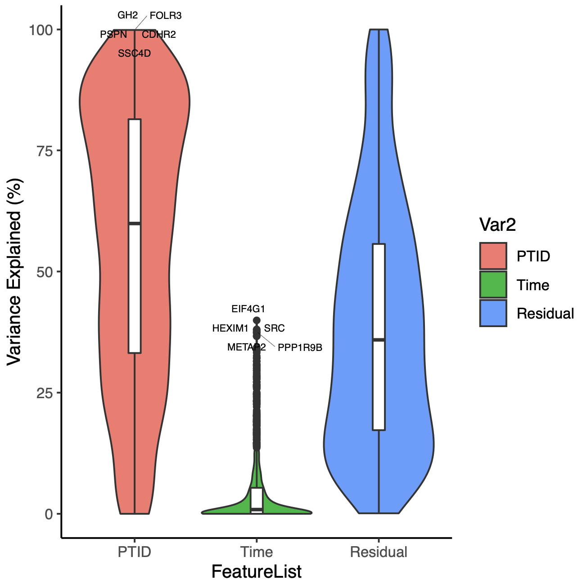{width="50%" height="50%"}  
    
    res <- lmem_res[,c("PTID","Time","Residual")]
    colnames(res) <- c("donor","week","Residuals")
    res <- res*100 #in percentage
    head(res)
    
    #Features      donor      week  Residuals
    #FOLR3   99.90070 0.0000000 0.09930098
    #GH2     99.49856 0.0000000 0.50144042
    #PSPN    99.26882 0.1021076 0.62906798
    #CDHR2   99.07933 0.1157406 0.80493162
    #SSC4D   98.82794 0.0000000 1.17206000
    #XPNPEP2 98.67628 0.0000000 1.32372323
    
### Donor-specific variance contrubuting features

    df1 <- filter(res, donor>week & Residuals < 50)
    df1 <- df1[order(df1$donor, decreasing = T),]
    df <- melt(data.matrix(df1[1:15,]))
    df$Var2 <- factor(df$Var2, levels = rev(c("donor","week", "Residuals")))
    df$Var1 <- factor(df$Var1, levels = rev(unique(df$Var1)))
    p1 <- ggplot(df, aes(x=Var1, y=value, fill=Var2)) +
        geom_bar(stat="identity", position="stack") +
        scale_fill_manual(values = c("donor"="#C77CFF", "celltype"="#00BFC4",
        "week"="#7CAE00", "Residuals"="grey")) +
        labs(x="Features", y="% Variance Explained") +
        theme_bw() + theme(axis.text.x = element_text(angle=90, hjust = 0.5,
        vjust = 1),legend.position = "right") +
        coord_flip()
    print(p1)
    
  {width="50%" height="50%"}  

### Plot the Top variables

    genelist <- c("FOLR3", "MICA", "EIF4G1", "SRC")
    uniSample <- as.character(unique(metadata$PTID))
    splots <- list()
    for(i in 1:length(genelist)) {
      geneName <- genelist[i]
      df <- data.frame(exp=as.numeric(datamatrix[geneName,]), metadata, stringsAsFactors = F)
      df$PTID <- factor(df$PTID, levels = uniSample)
      plot1 <- ggpubr::ggline(df, x = "PTID", y = "exp", 
                add.params = list(shape="Time"), add = c("mean_se", "jitter", "boxplot"), 
                ylab = "NPX", xlab = "Donor", title = geneName, legend = "none", 
                outlier.shape = NA) + scale_shape_manual(values = 0:10)
      splots[[i]] <- plot1
    }
    plot_grid(plotlist=splots, ncol= 2, align="hv")

  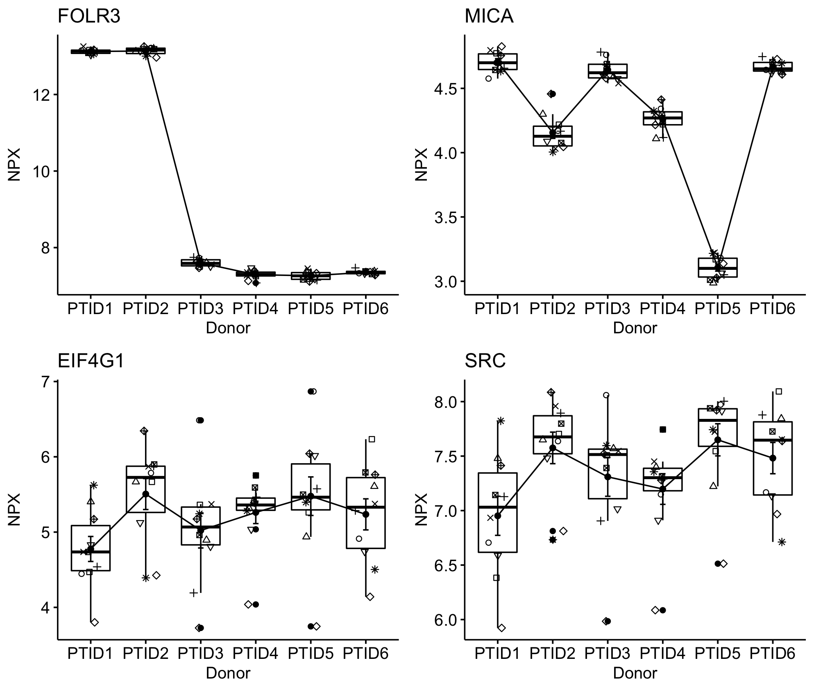 

### Intra-donor variations over time

    #CV vs Mean
    cv_res <- cvCalcBulk(mat=datamatrix, ann=metadata, meanThreshold=1, 
                        cvThreshold=5)

  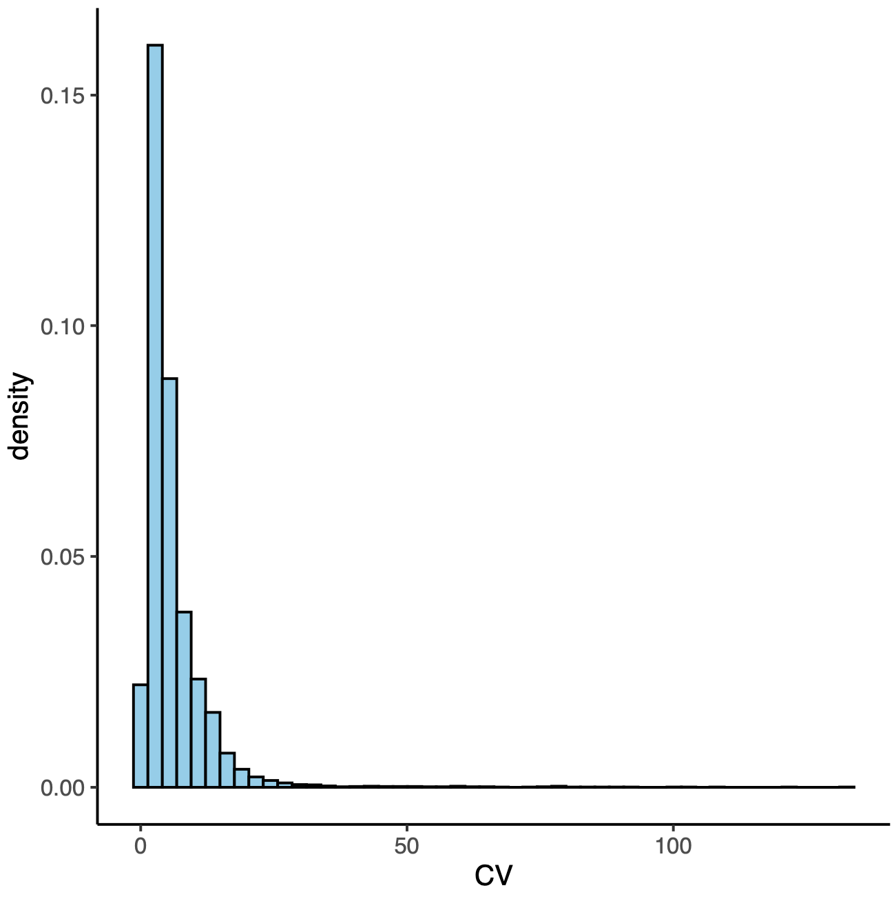{width="50%" height="50%"} 

    CV <- cv_res$CV
    variable_genes <- cv_res$variable_genes
    stable_genes <- cv_res$stable_genes
    
  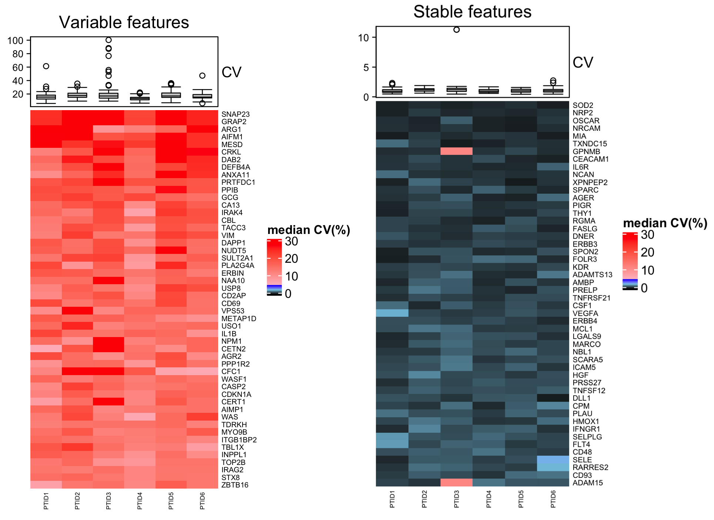{width="80%" height="80%"} 

### Outlier analysis

Perform the sample correlation to find out overall correlation between longitudinal samples.

    #Sample variability (Correlation)
    cor_res <- sample_correlation(data=datamatrix, column_sep = "W", 
                method="spearman")

  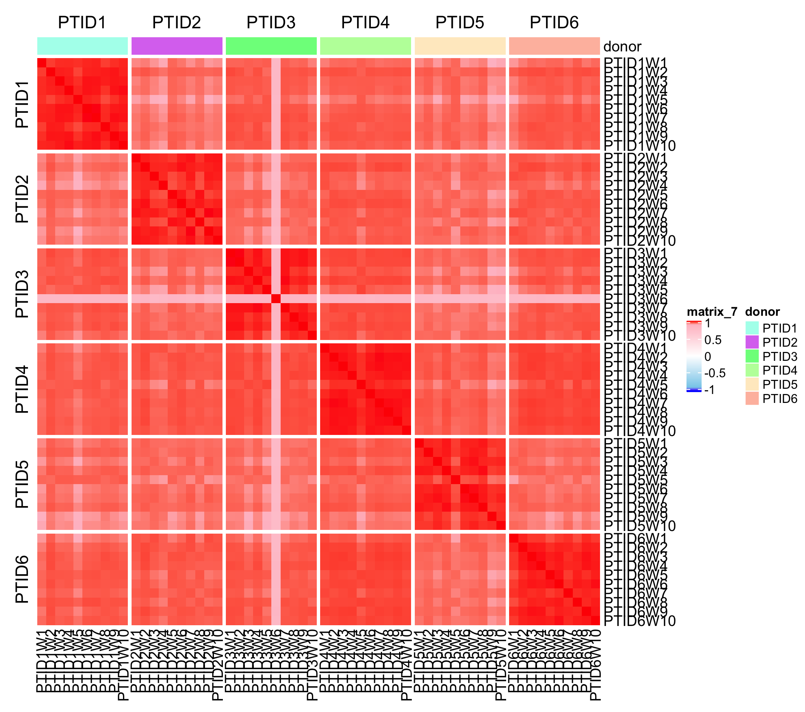{width="50%" height="50%"}  

    #Detect outliers (if any)
    outlier_res <- outlierDetect(ann=metadata, mat=datamatrix, z_cutoff=2)
    
    head(outlier_res)
    #  exp  Sample  PTID Time    Sex      gene  meanDev        z
    #PTID3W643 10.729880 PTID3W6 PTID3   W6 Female     IFI30 8.340474 2.845471
    #PTID3W627 10.133645 PTID3W6 PTID3   W6 Female     DPEP2 6.595705 2.844629
    #PTID3W631 10.188437 PTID3W6 PTID3   W6 Female      FCAR 7.004890 2.844607
    #PTID3W626  7.656418 PTID3W6 PTID3   W6 Female     DPEP1 4.574449 2.844574
    #PTID3W685  9.129149 PTID3W6 PTID3   W6 Female TNFRSF13C 6.605767 2.844410 2.844410
    #PTID3W652  8.031215 PTID3W6 PTID3   W6 Female   KIR2DL3 5.156982 2.844018

    #Stringent SD
    outlier_res <- outlierDetect(ann=metadata, mat=datamatrix, z_cutoff= 2.5)
    df <- data.frame(table(outlier_res$Sample))
    df <- df[order(df$Freq, decreasing = T),]
    head(df)
    #Var1 Freq
    #PTID3W6   71
    #PTID5W9   28
    #PTID4W5   20
    #PTID1W1   17
    #PTID1W8   12
    #PTID6W1    7
    
  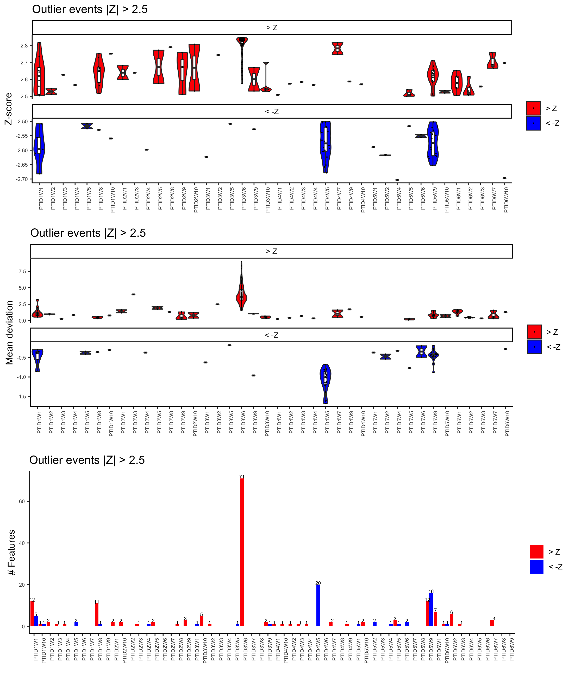{width="100%" height="100%"} 

    #Calculate p value
    outlierDetectP(outlier_events=outlier_res, z_cutoff=2.5, nGenes=1042)
    
  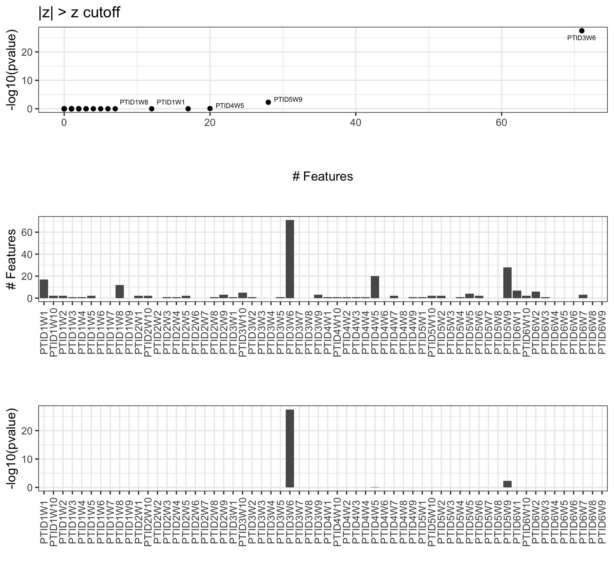{width="100%" height="100%"} 
    
    #### Gene plot (probable outliers)
    plots <- genePlot(ann=metadata, data=datamatrix, geneName="IFI30")
    plots[[5]]
    
    #or
    genelist <- c("IFI30", "DPEP2","FCAR", "TNFRSF13C", "IL15", "IL32")
    splots <- list()
    for(i in 1:length(genelist)) {
       geneName <- genelist[i]
       df <- data.frame(exp=as.numeric(datamatrix[geneName,]), metadata, stringsAsFactors = F)
       df$PTID <- factor(df$PTID, levels = uniSample)
       plot1 <- ggline(df, x = "PTID", y = "exp", add.params = list(shape="Time"),
       add = c("mean_se", "jitter"), ylab = "NPX", xlab = "Donor",
       title = geneName, legend = "right", outlier.shape = NA) +
       scale_shape_manual(values = 0:10) + 
       theme(axis.text.x = element_text(angle=45, hjust = 1, 
       vjust = 1))
       splots[[i]] <- plot1
    }
    plot_grid(plotlist=splots, ncol= 3, align="hv")

  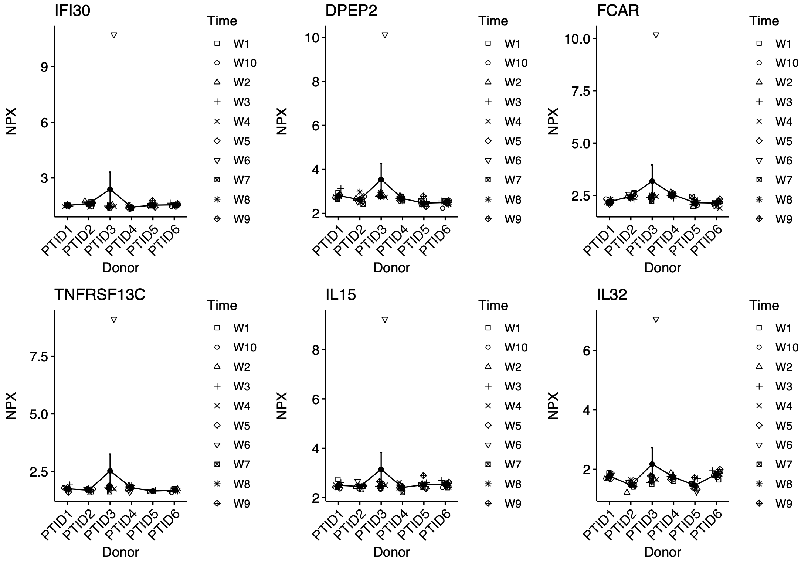{width="100%" height="100%"} 
    
##  Tutorial-2: scRNA longitudinal data (n=4 and 6 weeks follow-up)

This tutorial allows users to explore single cell RNAseq data measured from 4 healthy donors over 6 time points (week 2-7). Single cell data available at [GSE190992](https://www.ncbi.nlm.nih.gov/geo/query/acc.cgi?acc=GSE190992). (1) pbmc_longitudinal_data (Normalized scRNA seurat object) (2) data_Annotation.Rda (clinical metadata). Longitudinal data set includes 4 donors and 24 samples. To infer iner-donor, intra-donor variations, and stable features, please follow following steps.

### Load Library
   
    #Load Library
    library("PALM")
    library("Hmisc")
    library("ggpubr")
    library("Seurat")
    
### Load data and assign paramaters

    #scRNA seurat object
    pbmc <- readRDS("data/AIFI-scRNA-PBMC-FinalData.RDS")
    metaData <- pbmc@meta.data
    pbmc@meta.data$Sample <- pbmc@meta.data$orig.ident
    
    #UMAP plot
    p1 <- DimPlot(object = pbmc, reduction = 'umap', group.by = "Sample", label = F)
    p2 <- DimPlot(object = pbmc, reduction = 'umap', group.by = "celltype", label = F)
    print(plot_grid(p1, p2, align="hv", ncol=2))
    
  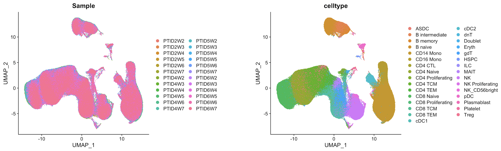 

### Load annotation data

    #Clinical metadata/annotation
    load("data/data_Metadata.Rda")
    metadata=ann
    row.names(metadata) <- metadata$Sample

    #Parameters
    dataObj <- pbmc
    featureSet <- c("PTID", "Time")
    avgGroup <- "celltype"
    housekeeping_genes <- c("GAPDH", "ACTB")

    #Celltypes observed in dataset
    cell_type <- sort(unique(pbmc@meta.data$celltype))
    #Celltypes selected for analysis consisting atleast >5% of cells in each celltype.
    group_oi <- c("CD4_Naive","CD4_TEM","CD4_TCM","CD4_CTL","CD8_Naive",
                  "CD8_TEM","CD8_TCM","Treg","MAIT","gdT",
                  "NK", "NK_CD56bright",
                  "B_naive", "B_memory", "B_intermediate",
                  "CD14_Mono","CD16_Mono",
                  "cDC2","pDC")
    
### Create output directory

    outputDirectory <- "output"
    filePATH <- paste(getwd(), "/",outputDirectory, sep="")
    dir.create(file.path(getwd(), outputDirectory), showWarnings = FALSE)
    
### Sample overlap

    overlap <- intersect(metadata$Sample, dataObj@meta.data$Sample)
    metadata <- metadata[overlap,]
    #in-case subset of samples only
    dataObj <- subset(x = dataObj, subset = Sample %in% overlap)
 
### Aggregate data at celltypes (pseudo-bulk)
### For single cell data merge annotation and single cell metadata

    metaData <- dataObj@meta.data
    metadata1 <- metadata[metaData$Sample,]
    metaData <- cbind(metaData, metadata1)
    dataObj@meta.data <- metaData

### Define sample group and Calculate average expression

    dataObj@meta.data$Sample_group <- paste(dataObj@meta.data$Sample,
                                dataObj@meta.data[,avgGroup], sep=":")
    dataObj@meta.data$Sample_group <- gsub(" ", "_", dataObj@meta.data$Sample_group)
    metaData <- dataObj@meta.data
    
### Calculate average expression across group/celltype
    
    Idents(dataObj) <- "Sample_group"
    table(Idents(dataObj))
    scrna_avgmat <- avgExpCalc(dataObj=dataObj, group.by="Sample_group")

### Keep genes with avgExpression > zero

    rowDF <- rowSums(scrna_avgmat)
    rowDF <- rowDF[rowDF > 0]
    mat <- scrna_avgmat[names(rowDF),]

### Create annotation

    cn <- data.frame(Sample_group=colnames(mat))
    temp <- data.frame(do.call(rbind, strsplit(cn$Sample_group, split = ":")), stringsAsFactors = F)
    cn <- data.frame(cn, Sample=temp$X1, group=temp$X2, stringsAsFactors = F)
    row.names(cn) <- cn$Sample_group
    cn <- merge(cn, metadata, by="Sample", all=TRUE)
    cn <- cn[!is.na(cn$Sample_group),]
    row.names(cn) <- cn$Sample_group
    ann <- cn
    ann$Sample_group_i <- paste(ann$group, ann$PTID, sep=":")
    rm(cn)

### Final matrix

    Overlap <- intersect(colnames(mat), row.names(ann))
    ann <- ann[Overlap,]
    mat <- mat[,Overlap]
    print(sort(unique(ann$group)))
    #[1] "ASDC"              "B_intermediate"    "B_memory"         
    #[4] "B_naive"           "CD14_Mono"         "CD16_Mono"        
    #[7] "CD4_CTL"           "CD4_Naive"         "CD4_Proliferating"
    #[10] "CD4_TCM"           "CD4_TEM"           "CD8_Naive"        
    #[13] "CD8_Proliferating" "CD8_TCM"           "CD8_TEM"          
    #[16] "cDC1"              "cDC2"              "dnT"              
    #[19] "Doublet"           "Eryth"             "gdT"              
    #[22] "HSPC"              "ILC"               "MAIT"             
    #[25] "NK"                "NK_CD56bright"     "NK_Proliferating" 
    #[28] "pDC"               "Plasmablast"       "Platelet"         
    #[31] "Treg"  

### CV profile

    #Check the mean expression and CV cross groups (celltypes)
    cv_profile <- cvprofile(mat=mat, ann=ann)

  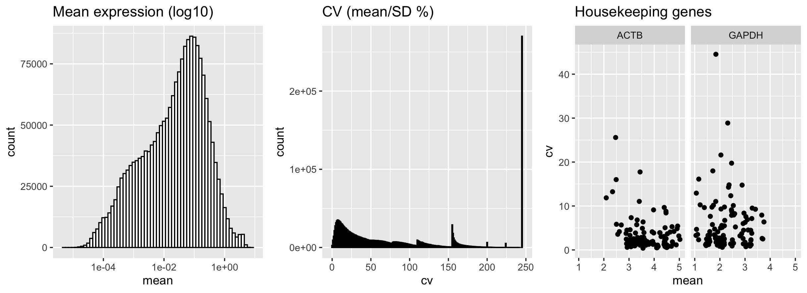  

    #Lowly expressed genes show abnormal CV, which needs to be filtered.
    cv_profile <- cvprofile(mat=mat, ann=ann, meanThreshold = 0.1)

  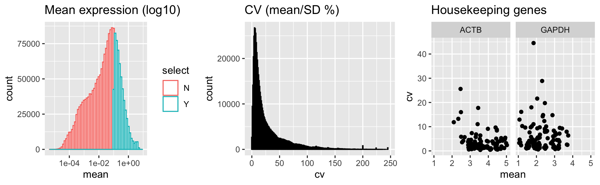  

    #Sample Celltype Mean-CV plot (check output folder)
    cvSampleprofile(mat=mat, ann=ann, meanThreshold = 0.1, cvThreshold = 10)
    
### Features contributing towards donor variations

    #Variance decomposition
    lmem_res <- lmeVariance(ann=ann, mat=mat, 
                featureSet=c(featureSet,"group"), 
                meanThreshold=0.1,
                fileName="scRNA", filePATH=filePATH)
    res <- lmem_res[,c("PTID","Time","group","Residual")]
    colnames(res) <- c("PTID","Time","celltype","Residuals")
    res <- res*100 #in percentage
    
  {width="50%" height="50%"} 
    
### Donor-specific variance

    #Donor-specific
    df1 <- filter(res, PTID>Time & PTID>celltype & Residuals < 50)
    df1 <- df1[order(df1$PTID, decreasing = T),]
    df <- melt(data.matrix(df1[1:15,]))
    df$Var2 <- factor(df$Var2, levels = rev(colnames(res)))
    df$Var1 <- factor(df$Var1, levels = rev(unique(df$Var1)))
    plot1 <- ggplot(df, aes(x=Var1, y=value, fill=Var2)) +
      geom_bar(stat="identity", position="stack") + labs(x="Features", y="% Variance explained") +
      scale_fill_manual(values = c("PTID"="#C77CFF", "celltype"="#00BFC4", "Time"="#7CAE00", "Residuals"="grey")) +
      theme_bw() + theme(axis.text.x = element_text(angle=90, hjust = 0.5, vjust = 1),legend.position = "right") +
      coord_flip()
    print(plot1)

  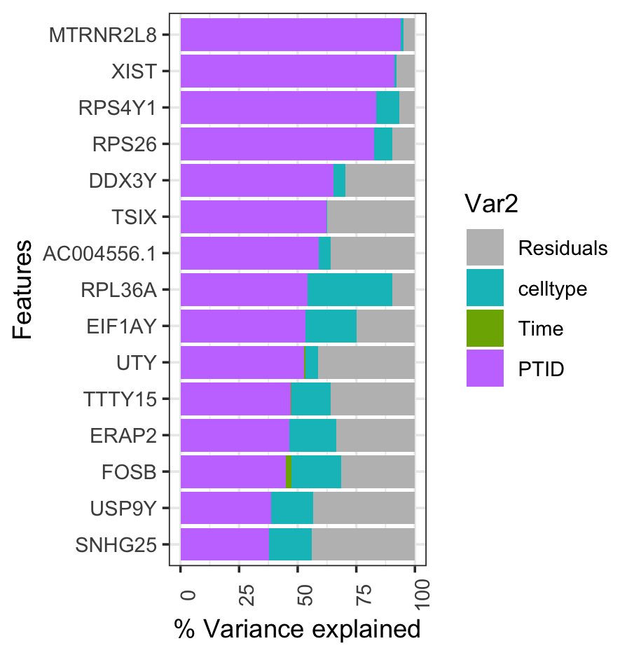{width="50%" height="50%"} 

    #Similar procedure applied to get Time- and celltype-attributed variance features
    
  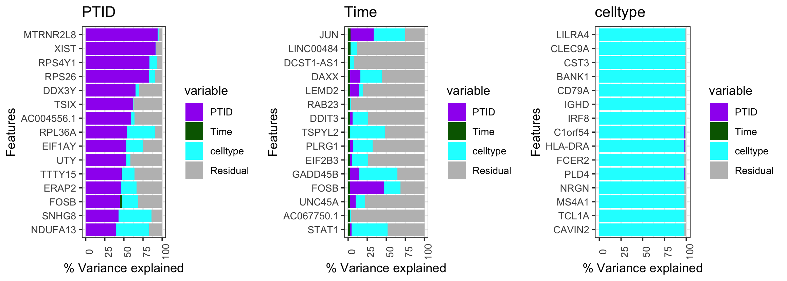 

### Plot the top features

    plots <- genePlot(ann=ann, data=mat, geneName="LILRA4", groupName="Time")
    print(plots$plot4)
    
  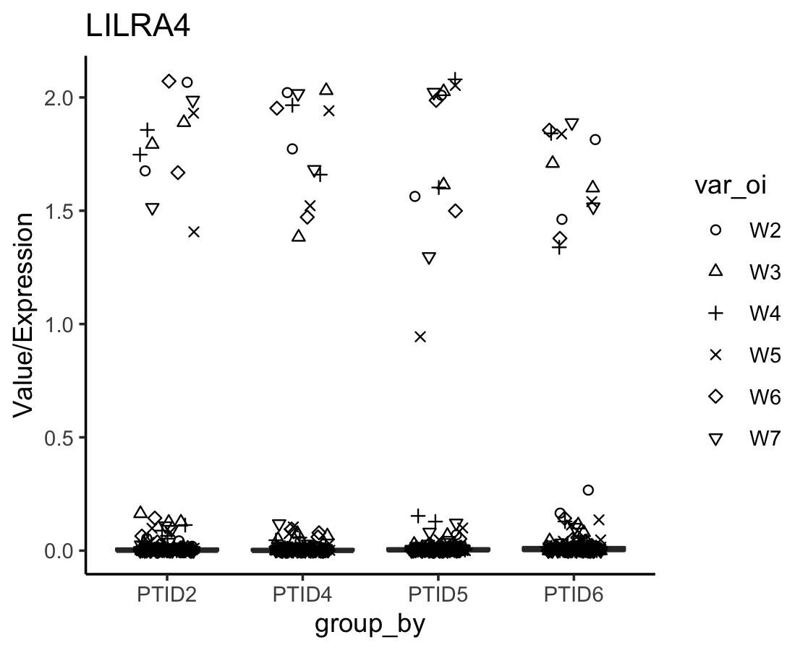{width="50%" height="50%"} 
    
    plots <- genePlot(ann=ann, data=mat, geneName="LILRA4", groupName="group")
    print(plots$plot5)
    
  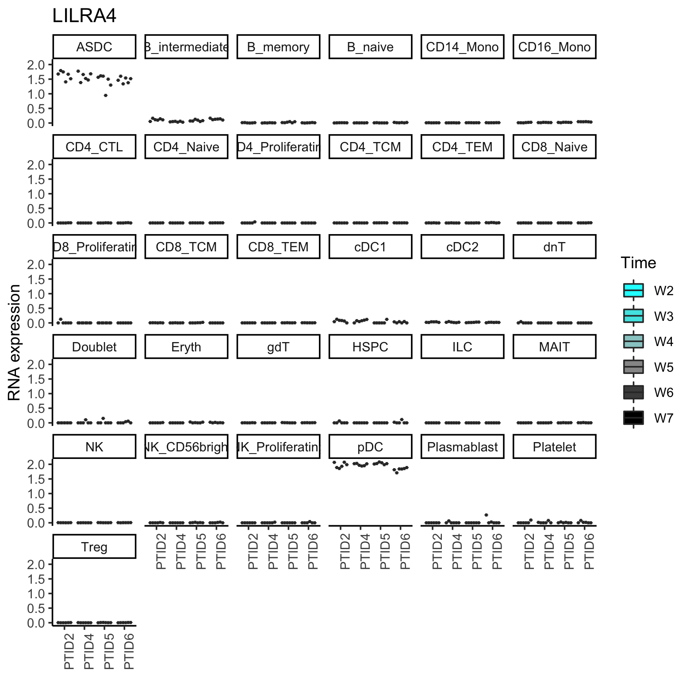 
    
### Intra-donor variations over time

    #Calculate CV
    cv_res <- cvCalcSC(mat=mat, ann=ann, meanThreshold=0.1,
              cvThreshold=10, housekeeping_genes=housekeeping_genes,
              filePATH=filePATH, fileName="scrna")
    
    #Plots saved in user-defined output directory

  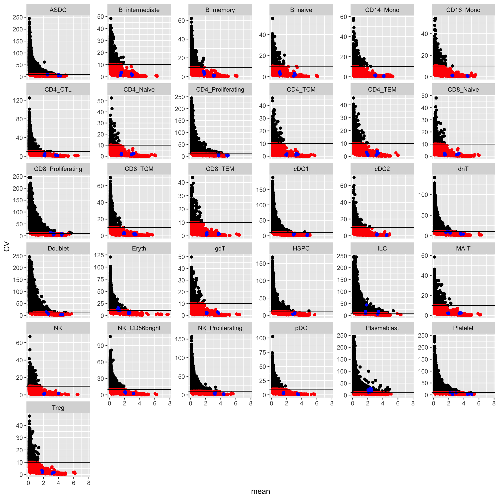  

CV profile in celltypes (black) as well as CV for house-keeping genes (blue). Based on CV of house-keeping genes 10% CV cut-off used and genes considered stable elow 10% CV.
    
### Find stable and variable features in longitudinal data

    donorThreshold <- 4
    groupThreshold <- 40 #number of donors * number of celltypes/2 (4x19/2)
    topFeatures <- 25
    var_gene <- VarFeatures(ann=ann, group_oi=group_oi,
                meanThreshold=0.1, cvThreshold=10,
                donorThreshold=donorThreshold, 
                groupThreshold=groupThreshold,
                topFeatures=topFeatures,
                fileName="scrna", filePATH=filePATH)
                
    stable_gene <- StableFeatures(ann=ann, group_oi=group_oi,
                    meanThreshold=0.1,
                    cvThreshold=10,
                    donorThreshold=donorThreshold,
                    groupThreshold=groupThreshold,
                    topFeatures=topFeatures,
                    fileName="scrna", filePATH=filePATH)

Variable genes observed in longitudinal data (CV>10%)

  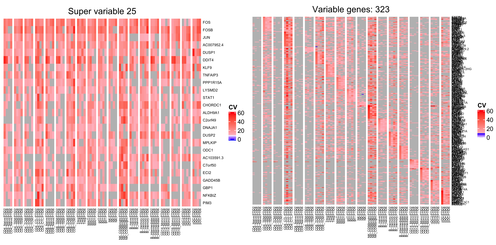  
    
Stable genes observed in longitudinal data (CV<10%)

  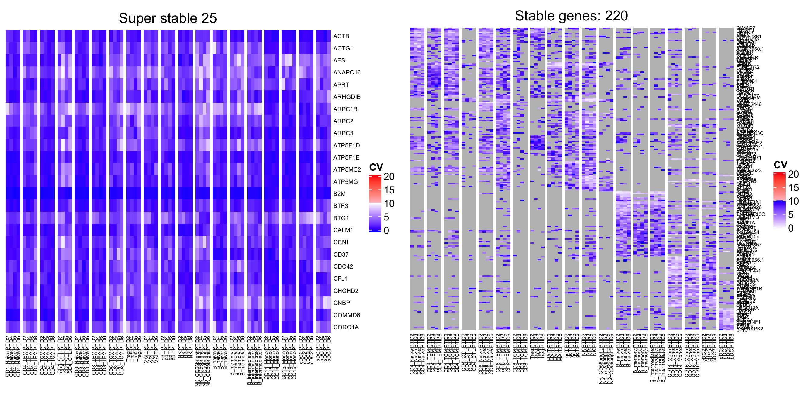  

### UMAP Plot (Stable/variable)

    #Top variable and stable features used for UMAP
    rnaObj <- dimUMAPPlot(rnaObj=dataObj, nPC=15,
              gene_oi=unique(var_gene$gene), groupName=avgGroup, 
              plotname="variable", fileName="scrna",
              filePATH=filePATH)
    
  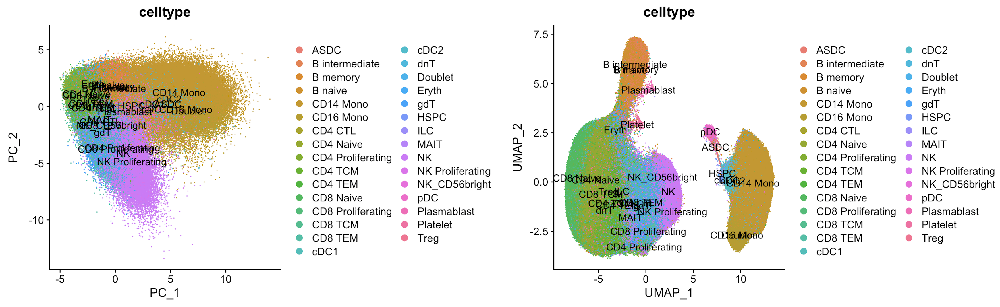  
    
    rnaObj <- dimUMAPPlot(rnaObj=dataObj, nPC=15,
              gene_oi=unique(stable_gene$gene), groupName=avgGroup, 
              plotname="stable", fileName="scrna",
              filePATH=filePATH)

    

### Circular gene expression plot

    load("output/scrna-CV-allgenes-raw.Rda")
    geneList <- c("IL32","CCL5","TCF7","IL7R","LEF1") #T-cell
    res <- genecircosPlot(data=cv_res, geneList=geneList, groupBy=group_oi)
    
  {width="50%" height="50%"}  

##  Tutorial-3: scATAC Longitudinal data (n=4 and 6 weeks follow-up)
This tutorial allows users to explore single cell ATACseq genscore data measured from 4 healthy donors over 6 timepoints (week 2-7). Single cell ATAC data available at [GSE190992](https://www.ncbi.nlm.nih.gov/geo/query/acc.cgi?acc=GSE190992).
(1) pbmc_scatac_archr_genescore_longitudinal_data (2) data_Annotation.Rda (clinical metadata). Longitudinal dataset have 4 donors and 18 samples. To infer the variations at single cell ATAC please follow following steps.

###  Load Library

    #Load Library
    library("PALM")
    library("Hmisc")
    library("ggpubr")

### Load data and assign paramaters

    #scATAC object
    #Load genescorematrix from archR or relevant tools (Aggregate data at celltypes (pseudo-bulk))
    load("data/AIFI-scATAC-PBMC-FinalData.Rda")
    boxplot(log2(scatac_gm[,1:50]+1), las=2)
    
    #Load annotation data
    load("data/data_Metadata.Rda")
    metadata <- ann
    row.names(metadata) <- metadata$Sample

### Parameters

    atacObj <- log2(scatac_gm+1) #Normalized genescore
    featureSet=c("PTID", "Time") 
    avgGroup="celltype"
    housekeeping_genes <- c("GAPDH", "ACTB")
    fileName <- "scatac"
    #Celltypes to be considered (selected in scRNA)
    group_oi <- c("CD4_Naive","CD4_TEM","CD4_TCM","CD4_CTL","CD8_Naive",
                  "CD8_TEM","CD8_TCM","Treg","MAIT","gdT",
                  "NK", "NK_CD56bright",
                  "B_naive", "B_memory", "B_intermediate",
                  "CD14_Mono","CD16_Mono", "cDC2","pDC")

### Create output directory

    outputDirectory <- "output"
    filePATH <- paste(getwd(), "/",outputDirectory, sep="")
    dir.create(file.path(getwd(), outputDirectory), showWarnings = FALSE)

### Sample overlap

    #Get the annotation
    temp <- data.frame(do.call(rbind, strsplit(colnames(atacObj), 
    split = ":")), stringsAsFactors = F)
    cn <- data.frame(id=colnames(atacObj), Sample=temp$X1, group=temp$X2,
    check.names=F, stringsAsFactors = F)
    cn <- cn[cn$Sample %in% metadata$Sample,]
    overlap <- as.character(unique(cn$Sample))
    atac_overlap <- cn$id
    
    #Sample overlap
    metadata <- metadata[overlap,]
    atacObj <- atacObj[,atac_overlap]

### Check data

    #Keep genes with avgExpression > zero
    rowDF <- rowSums(atacObj)
    rowDF <- rowDF[rowDF > 0]
    mat <- atacObj[names(rowDF),]

### Create annotation

    cn <- data.frame(Sample_group=colnames(mat))
    temp <- data.frame(do.call(rbind, strsplit(cn$Sample_group,
            split = ":")), stringsAsFactors = F)
    cn <- data.frame(cn, Sample=temp$X1, group=temp$X2,
            stringsAsFactors = F)
    row.names(cn) <- cn$Sample_group
    cn <- merge(cn, metadata, by="Sample", all=TRUE)
    cn <- cn[!is.na(cn$Sample_group),]
    row.names(cn) <- cn$Sample_group
    ann <- cn
    ann$Sample_group_i <- paste(ann$group, ann$PTID, sep=":")
    rm(cn)

### Final matrix

    Overlap <- intersect(colnames(mat), row.names(ann))
    ann <- ann[Overlap,]
    mat <- mat[,Overlap]
    print(sort(unique(ann$group)))
    #[1] "B_intermediate" "B_naive" "CD14_Mono" "CD16_Mono"     
    #[5] "CD4_Naive" "CD4_TCM" "CD8_Naive" "CD8_TEM"       
    #[9] "cDC2" "gdT" "MAIT" "NK"            
    #[13] "NK_CD56bright" "pDC"

### CV profile

    cv_profile <- cvprofile(mat=mat, ann=ann, housekeeping_genes=housekeeping_genes)
    
    

    cv_profile <- cvprofile(mat=mat, ann=ann, housekeeping_genes=housekeeping_genes, meanThreshold = 0.1)
    
  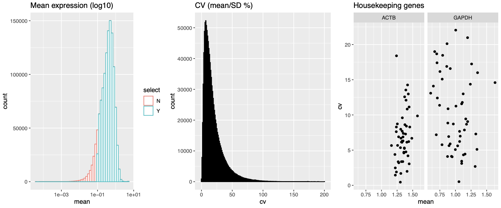  

    #Sample Celltype Mean-CV plot
    cv_sample_profile <- cvSampleprofile(mat=mat, ann=ann, meanThreshold = 0.1, cvThreshold = 10)
    #plots saved in output directory

### Features contributing towards donor variations

    lmem_res <- lmeVariance(ann=ann, mat=mat,
                featureSet=c(featureSet,"group"), 
                meanThreshold=0.1,
                fileName=fileName,
                filePATH=filePATH)
    res <- lmem_res[,c("PTID","Time","group","Residual")]
    colnames(res) <- c("PTID","Time","celltype","Residuals")
    res <- res*100 #in percentage

  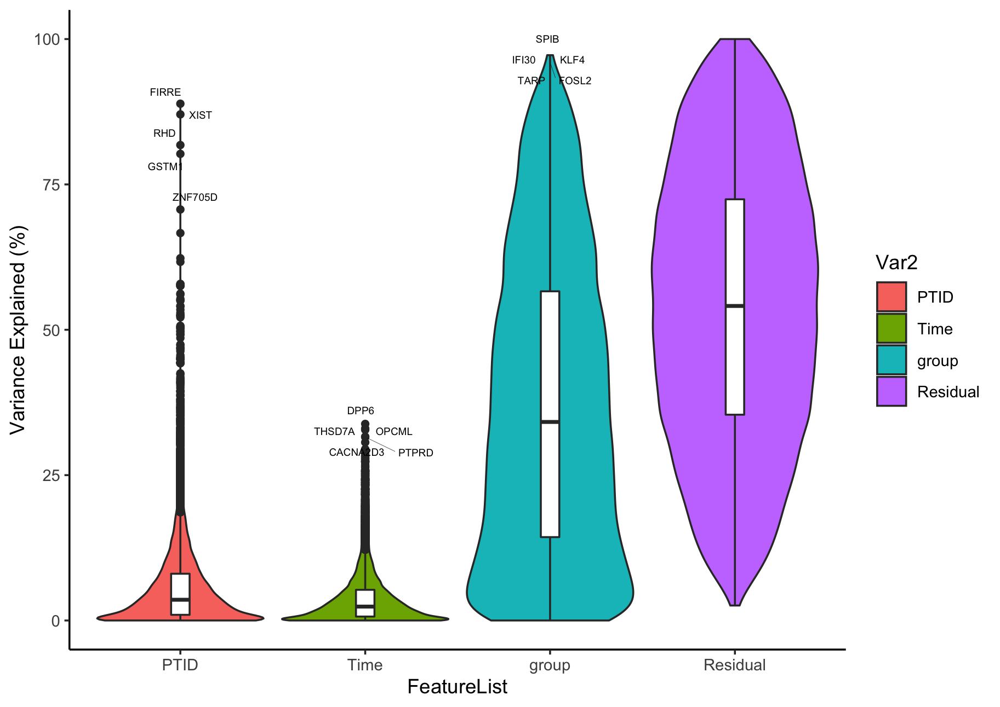{width="50%" height="50%"}   

    #Donor-specific
    df1 <- filter(res, PTID>Time & PTID>celltype & Residuals < 50)
    df1 <- df1[order(df1$PTID, decreasing = T),]
    df <- melt(data.matrix(df1[1:15,])) #select Top15
    df$Var2 <- factor(df$Var2, levels = rev(colnames(res)))
    df$Var1 <- factor(df$Var1, levels = rev(unique(df$Var1)))
    p1 <- ggplot(df, aes(x=Var1, y=value, fill=Var2)) +
      geom_bar(stat="identity", position="stack") + 
      labs(x="Features", y="% Variance explained") +
      scale_fill_manual(values = c("PTID"="#C77CFF", "celltype"="#00BFC4",
      "Time"="#7CAE00", "Residuals"="grey")) +
      theme_bw() + theme(axis.text.x = element_text(angle=90, hjust = 0.5,
      vjust = 1),legend.position = "right") +
      coord_flip()
    
    #Time-specific
    df2 <- filter(res, PTID<Time & Time>celltype)
    df2 <- df2[order(df2$Time, decreasing = T),]
    df <- melt(data.matrix(df2[1:15,])) #select Top15
    df$Var2 <- factor(df$Var2, levels = rev(colnames(res)))
    df$Var1 <- factor(df$Var1, levels = rev(unique(df$Var1)))
    p2 <- ggplot(df, aes(x=Var1, y=value, fill=Var2)) +
      geom_bar(stat="identity", position="stack") + 
      labs(x="Features", y="% Variance explained") +
      scale_fill_manual(values = c("PTID"="#C77CFF", "celltype"="#00BFC4",
      "Time"="#7CAE00", "Residuals"="grey")) +
      theme_bw() + theme(axis.text.x = element_text(angle=90, hjust = 0.5,
      vjust = 1),legend.position = "right") +
      coord_flip()
    
    #Celltype-specific
    df3 <- filter(res, celltype>PTID & celltype>Time & Residuals < 50)
    df3 <- df3[order(df3$celltype, decreasing = T),]
    df <- melt(data.matrix(df3[1:15,])) #select Top15
    df$Var2 <- factor(df$Var2, levels = rev(colnames(res)))
    df$Var1 <- factor(df$Var1, levels = rev(unique(df$Var1)))
    p3 <- ggplot(df, aes(x=Var1, y=value, fill=Var2)) +
      geom_bar(stat="identity", position="stack") + 
      labs(x="Features", y="% Variance explained") +
      scale_fill_manual(values = c("PTID"="#C77CFF", "celltype"="#00BFC4",
      "Time"="#7CAE00", "Residuals"="grey")) +
      theme_bw() + theme(axis.text.x = element_text(angle=90, hjust = 0.5,
      vjust = 1),legend.position = "right") +
      coord_flip()
    
    #Plot
    plot_grid(p1,p2,p3, align="hv", ncol=3)
    
  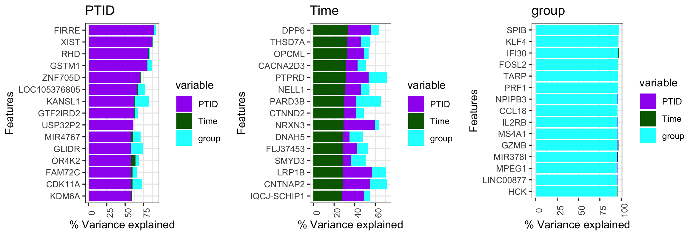  

    #Top genes
    plots <- genePlot(ann, mat, geneName="FIRRE", groupName="group")
    print(plots$plot1)
    print(plots$plot2)
    print(plots$plot3)
    print(plots$plot4)
    print(plots$plot5)
    plots <- genePlot(ann, mat, geneName="DPP6", groupName="group")
    plots <- genePlot(ann, mat, geneName="SPIB", groupName="group")

  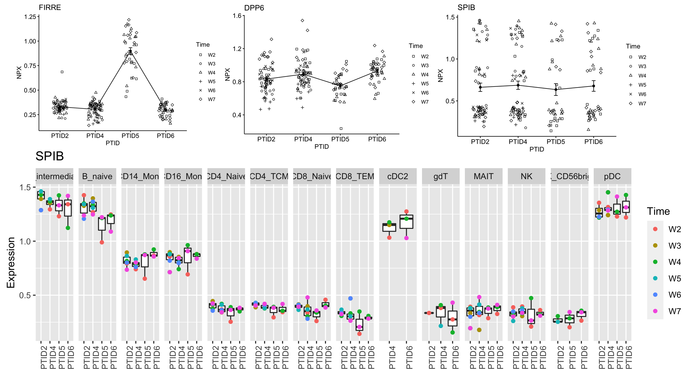  

### Intra-donor variations over time

    cv_res <- cvCalcSC(mat=mat, ann=ann,
                       meanThreshold=0.1,
                       cvThreshold=10, 
                       housekeeping_genes=housekeeping_genes, 
                       filePATH=filePATH, fileName=fileName)
                       
  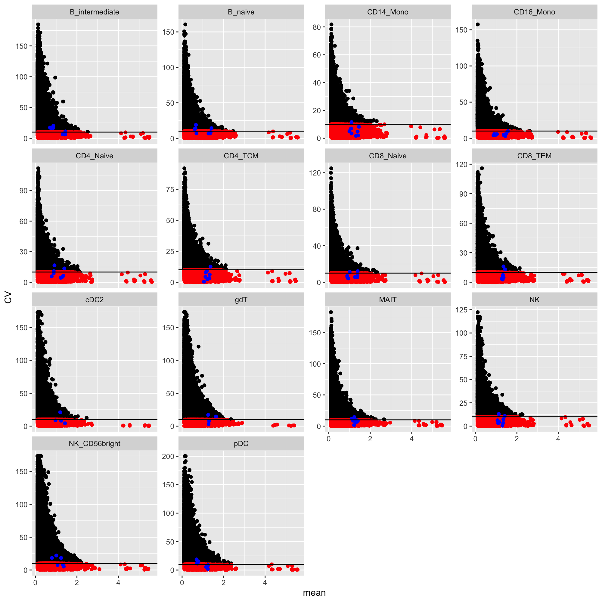  
    
### Find stable and variable features in longitudinal data

    donorThreshold <- 4
    groupThreshold <- 28 #number of donors * number of celltypes/2 (4x14/2)
    topFeatures <- 25
    stable_gene <- StableFeatures(ann=ann,
                    meanThreshold=0.1, 
                    cvThreshold=10,
                    donorThreshold=donorThreshold, 
                    groupThreshold=groupThreshold,
                    topFeatures=topFeatures,
                    fileName=fileName,
                    filePATH=filePATH)
    
  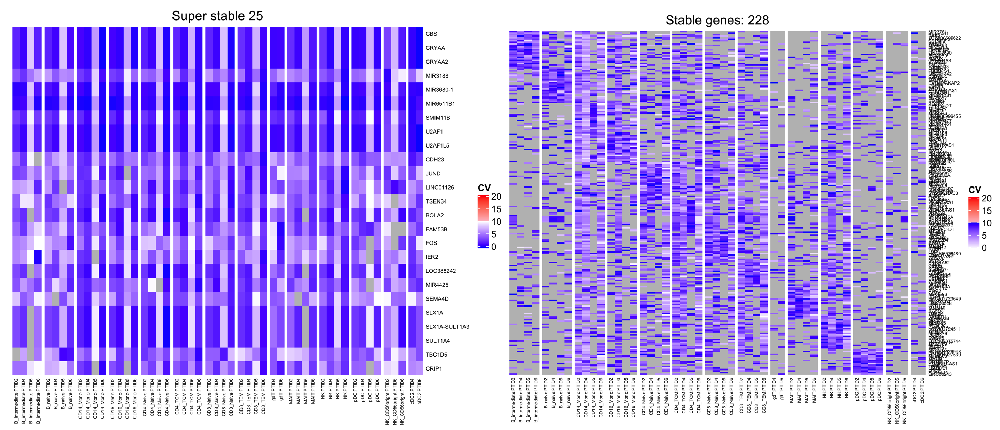  

    var_gene <- VarFeatures(ann=ann,
                    meanThreshold=0.1, 
                    cvThreshold=10,
                    donorThreshold=donorThreshold, 
                    groupThreshold=groupThreshold,
                    topFeatures=topFeatures,
                    fileName=fileName,
                    filePATH=filePATH)

  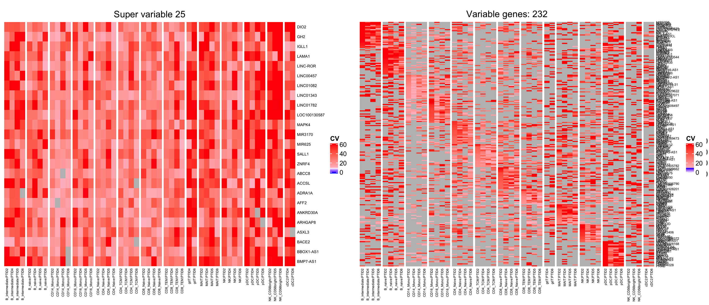  

### Circos CV plot

    load(paste(filePATH,"/",fileName,"-CV-allgenes-raw.Rda", sep=""))
    geneList <- c("HLA-A","HLA-B","HLA-C",
                  "HLA-DRA","HLA-DPA1","HLA-DRB1",
                  "ACTB","GAPDH")
    res <- genecircosPlot(data=cv_res, geneList=geneList, colorThreshold=10)
    
    #Can use threshold 15 based on housekeeping genes 
    group_oi <- c("CD4_Naive","CD4_TEM","CD4_TCM","CD4_CTL",
                  "CD8_Naive","CD8_TEM","CD8_TCM","Treg","MAIT","gdT",
                  "NK", "NK_CD56bright",
                  "B_naive","B_memory", "B_intermediate",
                  "CD14_Mono","CD16_Mono",
                  "cDC2","pDC")
    res <- genecircosPlot(data=cv_res, geneList=geneList, groupBy=group_oi, colorThreshold=15)
    
  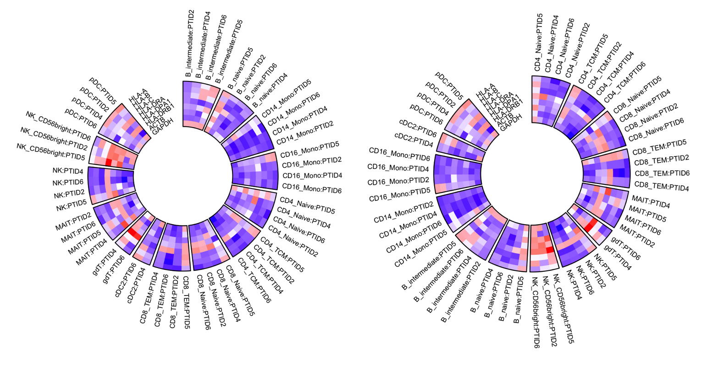  

##  Tutorial-4: Multi-modal data integration
This tutorial allows users to combine intra-donor variation value between different modalities like scRNA and scATAC data here. Load CV values from scRNA () and scATAC () as described above (check output directory for the files). To integrate variability across modalities, please follow following steps.

### Load Library
   
    #Load Library
    library("PALM")
    library("Hmisc")
    library("ggpubr")
    library("Seurat")
    
### Load data

    #From scRNA analysis obtain the CV data
    load("data/result/scrna-CV-allgenes-raw.Rda")
    scrna_cv_res <- cv_res

    #From scATAC analysis obtain the CV data
    load("data/result/scatac-CV-allgenes-raw.Rda")
    scatac_cv_res <- cv_res

    #Cell type of interest
    cell_type_oi <- c("CD4_Naive","CD4_TEM","CD4_TCM","CD4_CTL",
                      "CD8_Naive","CD8_TEM","CD8_TCM","Treg",
                      "MAIT","gdT", "NK", "NK_CD56bright",
                      "B_naive", "B_memory", "B_intermediate",
                      "CD14_Mono","CD16_Mono",
                      "cDC2","pDC")

    geneList <- c("HLA-A","HLA-B","HLA-C","HLA-DRA","HLA-DPA1","HLA-DRB1") #HLAs
    
### Run

    res <- multimodalView(modality1=scrna_cv_res,  
                   modality2=scatac_cv_res,
                   geneList=geneList,
                   groupBy=cell_type_oi)
                   
  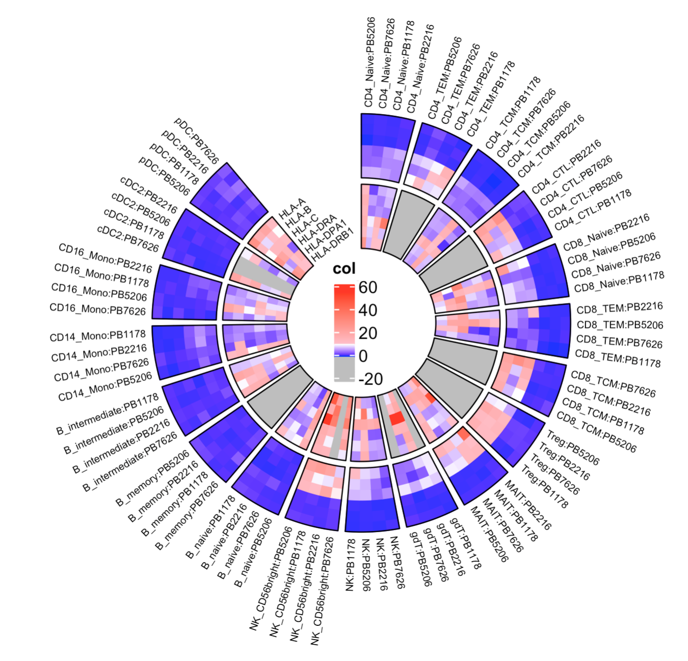{width="50%" height="50%"}  
    
##  Tutorial-5: CNP0001102 data
This tutorial allows users to explore single cell RNAseq data variability across COVID and FLU donors. PBMC from the patients were collected longitudinally. Single cell data from [Zhu et al. 2020](https://www.ncbi.nlm.nih.gov/pmc/articles/PMC7368915/) downloaded from [here](https://db.cngb.org/search/project/CNP0001102/). Metadata is downloaded from table and can be found in the [data](https://github.com/aifimmunology/PALM/tree/main/data). To infer variability (inter- and Intra-) and identify stable genes, please follow following steps.

### Load Library
   
    #Load Library
    library("PALM")
    library("Hmisc")
    library("ggpubr")
    library("Seurat")
    
### Load data and assign paramaters

    #Load scRNA data
    pbmc <- readRDS("data/CNP0001102_Final_nCoV_0716_upload.RDS")
    pbmc@meta.data$Sample <- pbmc@meta.data$batch
    pbmc@meta.data$celltype <- gsub(" ", "_", pbmc@meta.data$cell_type)
        
    #Clinical annotations (Table S1. Clinical data of the enrolled subjects)
    metadata <- read.csv("data/CNP0001102-annotation.csv", stringsAsFactors = F)
    row.names(metadata) <- metadata$Sample

    #Exploring only COVID samples 
    metadata <- metadata[metadata$PTID %in% c("COV-1", "COV-2", "COV-3", "COV-4", "COV-5"),]
    #Exploring only FLU samples
    metadata <- metadata[metadata$PTID %in% c("IAV-1","IAV-2"),]
        
    #Parameters
    dataObj <- pbmc
    featureSet=c("PTID", "Time") 
    avgGroup="celltype"
    housekeeping_genes <- c("GAPDH", "ACTB")
    cell_type <- sort(unique(pbmc@meta.data$celltype))
    fileName="CNP0001102"
    
### Create output directory (optional)

    outputDirectory <- "output"
    filePATH <- paste(getwd(), "/",outputDirectory, sep="")
    dir.create(file.path(getwd(), outputDirectory), showWarnings = FALSE)
    
### Sample overlap

    overlap <- intersect(metadata$Sample, dataObj@meta.data$Sample)
    metadata <- metadata[overlap,]
    #in-case subset of samples only
    dataObj <- subset(x = dataObj, subset = Sample %in% overlap)
 
### Aggregate data at celltypes (pseudo-bulk)

    #For single cell data merge annotation and single cell metadata
    metaData <- dataObj@meta.data
    metadata1 <- metadata[metaData$Sample,]
    metaData <- cbind(metaData, metadata1)
    dataObj@meta.data <- metaData

### Define sample group and Calculate average expression

    dataObj@meta.data$Sample_group <- paste(dataObj@meta.data$Sample,
    dataObj@meta.data[,avgGroup], sep=":")
    dataObj@meta.data$Sample_group <- gsub(" ", "_", dataObj@meta.data$Sample_group)
    metaData <- dataObj@meta.data
    
### Calculate average expression across group/celltype
    
    Idents(dataObj) <- "Sample_group"
    table(Idents(dataObj))
    scrna_avgmat <- avgExpCalc(dataObj=dataObj, group.by="Sample_group")

### Keep genes with avgExpression > zero

    rowDF <- rowSums(scrna_avgmat)
    rowDF <- rowDF[rowDF > 0]
    mat <- scrna_avgmat[names(rowDF),]

### Create annotation

    cn <- data.frame(Sample_group=colnames(mat))
    temp <- data.frame(do.call(rbind, strsplit(cn$Sample_group, split = ":")),
            stringsAsFactors = F)
    cn <- data.frame(cn, Sample=temp$X1, group=temp$X2, stringsAsFactors = F)
    row.names(cn) <- cn$Sample_group
    cn <- merge(cn, metadata, by="Sample", all=TRUE)
    cn <- cn[!is.na(cn$Sample_group),]
    row.names(cn) <- cn$Sample_group
    ann <- cn
    ann$Sample_group_i <- paste(ann$group, ann$PTID, sep=":")
    rm(cn)

### Final matrix

    Overlap <- intersect(colnames(mat), row.names(ann))
    ann <- ann[Overlap,]
    mat <- mat[,Overlap]
    print(unique(ann$group))
    
    #[1] "Activated_CD4_T_cells" "Cycling_Plasma"        "Cycling_T_cells"       "Cytotoxic_CD8_T_cells"
    #[5] "MAIT"                  "Megakaryocytes"        "Memory_B_cells"        "Naive_B_cells"        
    #[9] "Naive_T_cells"         "NKs"                   "Plasma"                "Stem_cells"           
    #[13] "XCL+_NKs"              "DCs"                   "Monocytes" 

### CV profile

    cv_profile <- cvprofile(mat=mat, ann=ann, meanThreshold = 0.1)
    
    

    #Sample Celltype Mean-CV plot (output directory)
    cv_sample_profile <- cvSampleprofile(mat=mat, ann=ann, meanThreshold = 0.1, cvThreshold = 25)

### Features contributing towards donor variations

    #Variance decomposition
    lmem_res <- lmeVariance(ann=ann, mat=mat,
                        featureSet=c(featureSet,"group"),
                        meanThreshold=0.1,
                        fileName=fileName,
                        filePATH=filePATH)
    res <- lmem_res[,c("PTID","Time","group","Residual")]
    colnames(res) <- c("PTID","Time","celltype","Residuals")
    res <- res*100 #in percentage
    
  {width="50%" height="50%"}  
    
    head(res[order(res$celltype, decreasing = T),])
    #        PTID         Time celltype Residuals
    #MZB1    3.634604e-08 1.242595e-09 93.91550  6.084498
    #JCHAIN  0.000000e+00 0.000000e+00 93.67179  6.328213
    #MKI67   3.013979e-01 1.236726e-01 92.19240  7.382530
    #MANF    3.197369e-01 0.000000e+00 91.82359  7.856671
    #SDF2L1  5.210284e-02 1.019559e-01 90.75454  9.091404
    #POU2AF1 2.432974e-01 3.463273e-01 90.24514  9.165233

### Variance explained

    #Donor-specific
    df1 <- filter(res, PTID>Time & PTID>celltype & Residuals < 50)
    df1 <- df1[order(df1$PTID, decreasing = T),]
    df <- melt(data.matrix(df1[1:15,]))
    df$Var2 <- factor(df$Var2, levels = rev(colnames(res)))
    df$Var1 <- factor(df$Var1, levels = rev(unique(df$Var1)))
    p1 <- ggplot(df, aes(x=Var1, y=value, fill=Var2)) +
      geom_bar(stat="identity", position="stack") +
      labs(x="Features", y="% Variance explained") +
      scale_fill_manual(values = c("PTID"="#C77CFF", "celltype"="#00BFC4",
      "Time"="#7CAE00", "Residuals"="grey")) +
      theme_bw() + theme(axis.text.x = element_text(angle=90, hjust = 0.5,
      vjust = 1),legend.position = "right") +
      coord_flip()
    
    #Time-specific
    df2 <- filter(res, Time>PTID & Time>celltype & Residuals < 50)
    #df2 <- res[order(res$Time, decreasing = T),]
    #select Top15
    df2 <- df2[1:15,]
    df <- melt(data.matrix(df2))
    df$Var2 <- factor(df$Var2, levels = rev(colnames(res)))
    df$Var1 <- factor(df$Var1, levels = rev(unique(df$Var1)))
    p2 <- ggplot(df, aes(x=Var1, y=value, fill=Var2)) +
      geom_bar(stat="identity", position="stack") +
      labs(x="Features", y="% Variance explained") +
      scale_fill_manual(values = c("PTID"="#C77CFF", "celltype"="#00BFC4",
      "Time"="#7CAE00", "Residuals"="grey")) +
      theme_bw() + theme(axis.text.x = element_text(angle=90, hjust = 0.5,
      vjust = 1),legend.position = "right") +
      coord_flip()
    
    #celltype-specific
    df3 <- filter(res, celltype>PTID & celltype>Time & Residuals < 50)
    df3 <- df3[order(df3$celltype, decreasing = T),]
    #select Top15
    df3 <- df3[1:15,]
    df <- melt(data.matrix(df3))
    df$Var2 <- factor(df$Var2, levels = rev(colnames(res)))
    df$Var1 <- factor(df$Var1, levels = rev(unique(df$Var1)))
    p3 <- ggplot(df, aes(x=Var1, y=value, fill=Var2)) +
      geom_bar(stat="identity", position="stack") +
      labs(x="Features", y="% Variance explained") +
      scale_fill_manual(values = c("PTID"="#C77CFF", "celltype"="#00BFC4",
      "Time"="#7CAE00", "Residuals"="grey")) +
      theme_bw() + theme(axis.text.x = element_text(angle=90, hjust = 0.5,
      vjust = 1),legend.position = "right") +
      coord_flip()
    
    #Plot
    plot_grid(p1,p2,p3, align="hv", ncol=3) 
    
    

### Plot the variables

    plots <- genePlot(ann, mat, geneName="MKI67", groupName="group")
    print(plots$plot1)
    print(plots$plot2)
    print(plots$plot3)
    print(plots$plot4)
    print(plots$plot5)
    
  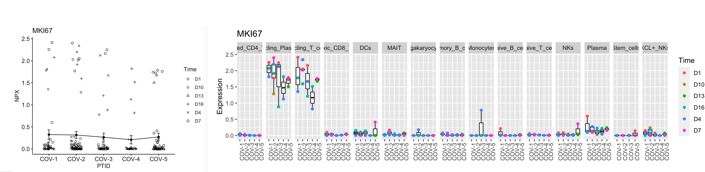  
    
### Intra-donor variations over time

    #Calculate CV
    meanThreshold=0.1
    cvThreshold=25
    cv_res <- cvCalcSC(mat=mat, ann=ann,
                       meanThreshold=meanThreshold,
                       cvThreshold=cvThreshold, 
                       housekeeping_genes=housekeeping_genes,
                       fileName=fileName,
                       filePATH=filePATH)

    

### Find stable and variable features in longitudinal data

    donorThreshold <- 5 #number of donors
    groupThreshold <- 38 #number of donors * number of celltypes/2 (5x15/2)
    topFeatures <- 25
    stable_gene <- StableFeatures(ann=ann, 
                                  meanThreshold=meanThreshold,
                                  cvThreshold=cvThreshold,
                                  donorThreshold=donorThreshold,
                                  groupThreshold=groupThreshold,
                                  topFeatures=topFeatures,
                                  fileName=fileName,
                                  filePATH=filePATH)
    
    

    var_gene <- VarFeatures(ann=ann, 
                            meanThreshold=meanThreshold,
                            cvThreshold=cvThreshold,
                            donorThreshold=donorThreshold,
                            groupThreshold=groupThreshold,
                            topFeatures=topFeatures,
                            fileName=fileName,
                            filePATH=filePATH)
    
    

### UMAP Plot

    #Stable genes UMAP
    dimUMAPPlot(rnaObj=dataObj, nPC=15, 
                gene_oi=unique(stable_gene$gene), groupName=avgGroup,
                plotname="stable", filePATH=filePATH, fileName=fileName)

    
    
    #Variable genes UMAP
    dimUMAPPlot(rnaObj=dataObj, nPC=15,
                gene_oi=unique(var_gene$gene), groupName=avgGroup,
                plotname="variable", filePATH=filePATH, fileName=fileName)

    

### Circos CV Plot

    load(paste(filePATH,"/",fileName, "-CV-allgenes-raw.Rda", sep=""))
    geneList <- c("IRF3","MAP4K4","XPC","DNAJB6", "KLF13") #Activated CD4 T-cells
    geneList <- c("HMGN2", "IFI16", "PTGES3", "SH3KBP1", "PTBP1") #Cycling T-cells
    res <- genecircosPlot(data=cv_res, geneList=geneList, colorThreshold=cvThreshold)
    
    

##  Tutorial-6: Differential Gene analysis in longitudinal data

This tutorial allows users to identify differential expressed genes in direction of time-points. As an example single cell data from [Zhu et al. 2020](https://www.ncbi.nlm.nih.gov/pmc/articles/PMC7368915/) downloaded from [here](https://db.cngb.org/search/project/CNP0001102/). Metadata is downloaded from table and can be found in the [data](https://github.com/aifimmunology/PALM/tree/main/data). The dataset consists of 5 Covid-19 donors, 2 Flu donors with longitudinal data and 3 controls. To explore differetial expressed gened in each celltype of each donor we used hurdle model based modeling on input data to retrive the DEGs. To infer DEGs in each celltype towards time progression (timepoints considered as continoues if more than 2), please follow following steps.

### load data and clinical metadata

Single cell object CNP0001102
    
    pbmc <- readRDS("data/CNP0001102_Final_nCoV_0716_upload.RDS")
    #Add column Sample and group as celltype
    pbmc@meta.data$Sample <- pbmc@meta.data$batch
    pbmc@meta.data$celltype <- gsub(" ", "_", pbmc@meta.data$cell_type)
    
### Clinical annotations [Table S1. Clinical data of the enrolled subjects](https://www.ncbi.nlm.nih.gov/pmc/articles/PMC7368915/)
    
    metadata <- read.csv("data/CNP0001102-annotation.csv", stringsAsFactors = F)
    row.names(metadata) <- metadata$Sample
    
### Load library and run

    library("PALM")
    #run
    DEGres <- sclongitudinalDEG(ann=metadata, dataObj=pbmc, scassay="RNA", celltypecol="celltype")
    
    >Fitting a ZLM model for donorID:  COV-1 
    >Fitting a ZLM model for donorID:  COV-2 
    >Fitting a ZLM model for donorID:  COV-3 
    >Fitting a ZLM model for donorID:  COV-4 
    >Fitting a ZLM model for donorID:  COV-5 
    >Fitting a ZLM model for donorID:  IAV-1 
    >Fitting a ZLM model for donorID:  IAV-2 

    #Plots can be seen in output directory output
    head(DEGres[order(DEGres$coef, decreasing = T),])
    
    #primerid contrast         nomP     coef         adjP donorID celltype dir
    #IGHG4   TimeD9 1.701579e-26 3.056092 1.453999e-23   IAV-2   Plasma upregulated at D9
    #JCHAIN   TimeD9 8.759407e-32 2.647757 2.245474e-28   IAV-2   Plasma upregulated at D9
    #IGHG3   TimeD9 8.470810e-22 2.485250 2.412769e-19   IAV-2   Plasma upregulated at D9
    #IGLC2   TimeD9 1.352490e-16 2.289544 8.890022e-15   IAV-2   Plasma upregulated at D9
    #IGHG1   TimeD9 1.292885e-16 2.219146 8.608601e-15   IAV-2   Plasma upregulated at D9
    #SYNE2   TimeD4 7.249010e-13 2.209541 1.215659e-09   COV-4 XCL+_NKs upregulated at D4

General analysis schema and differential results in each donor over timepoints in celltype Cytotoxic CD8 T-cells using `PALM` shown below.

   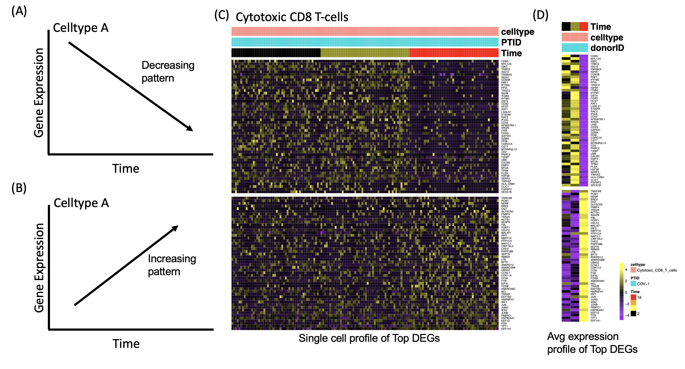   

#  Quick Usage

    #Load libraries
    library("PALM")
    library("Hmisc")
    library("ggpubr")

##  Plasma proteome
    
    #Load Plasma proteomic expression (NPX) data
    load("data/Olink_NPX_log2_Protein.Rda")
    #Clinical Metdata/annotation
    load("data/data_Metadata.Rda")
    #Run longuitudinal analysis
    ld_res <- PALM(metadata=ann,
                               data=data,
                               datatype="bulk",
                               omics="plasmaproteome",
                               featureSet=c("PTID", "Time"),
                               meanThreshold=1, cvThreshold=5,
                               NA_threshold=0.4,
                               column_sep="W",
                               method="spearman",
                               clusterBy="donor",
                               z_cutoff=2,
                               doOutlier=TRUE,
                               fileName="proteome",
                               outputDirectory="output")

##  Single cell RNA data
    
    #Seurat object (Check for Sample and column)
    pbmc <- readRDS("data/AIFI-scRNA-PBMC-FinalData.RDS")
    pbmc@meta.data$Sample <- pbmc@meta.data$orig.ident
    #Clinical Metdata/annotation
    load("data/data_Metadata.Rda")
    
    #Celltypes observed
    cell_type <- c("CD4_Naive","CD4_TEM","CD4_TCM","CD4_CTL","CD8_Naive",
                   "CD8_TEM","CD8_TCM","Treg","MAIT","gdT","dnT", 
                   "CD4_Proliferating", "CD8_Proliferating",             
                   "NK_Proliferating",
                   "NK", "NK_CD56bright",
                   "B_naive", "B_memory", "B_intermediate","Plasmablast",
                   "CD14_Mono","CD16_Mono",
                   "cDC1","cDC2","pDC","ASDC",
                   "Platelet","Eryth", "ILC","HSPC","Doublet")
    #Selected celltypes (manuscript) based on proportions >5%
    group_oi <- c("CD4_Naive","CD4_TEM","CD4_TCM","CD4_CTL","CD8_Naive",
                  "CD8_TEM","CD8_TCM","Treg","MAIT","gdT",
                  "NK", "NK_CD56bright",
                  "B_naive", "B_memory", "B_intermediate",
                  "CD14_Mono","CD16_Mono",
                  "cDC2","pDC")
    
    #Run longuitudinal analysis
    ld_res <- PALM(metadata=ann, 
                               data=pbmc, 
                               datatype="singlecell", omics="rna",
                               featureSet=c("PTID", "Time"),
                               meanThreshold=0.1, cvThreshold=10,
                               housekeeping_genes=c("GAPDH", "ACTB"),
                               avgGroup="celltype", 
                               group_oi=group_oi,
                               donorThreshold=4, groupThreshold=40,
                               topFeatures=25,
                               method="spearman", column_sep=":",
                               clusterBy="group", z_cutoff=2,
                               fileName="scrna",
                               outputDirectory="output")
    
##  Single cell ATAC data

Load genescorematrix from archR or relevant tools (Aggregate data at celltypes (pseudo-bulk)) 

    #scATAC object
    load("data/AIFI-scATAC-PBMC-FinalData.Rda") #aggregated genescore
    data <- log2(scatac_gm+1) #log2 
    #Load annotation data
    load("data/data_Metadata.Rda")
    
    #Run longuitudinal analysis
    ld_res <- PALM(metadata=ann,
                               data=data,
                               datatype="singlecell", omics="atac",
                               featureSet=c("PTID", "Time"),
                               meanThreshold=0.1, cvThreshold=10,
                               housekeeping_genes=c("GAPDH", "ACTB"),
                               avgGroup="celltype",
                               group_oi=group_oi,
                               donorThreshold=4, groupThreshold=28,
                               topFeatures=25,
                               column_sep=":", method="spearman",
                               clusterBy="group", z_cutoff=2,
                               fileName="scatac",
                               outputDirectory="output")

#  Authors

[Suhas Vasaikar](https://github.com/suhasaii), [Aarthi talla](https://github.com/aarthitallaAI) and [Xiaojun Li](https://github.com/Xiaojun-Li) designed the PALM algorithm. [Suhas Vasaikar](https://github.com/suhasaii) implemented the PALM package.

#  License
PALM is licensed under the [MIT-License](https://github.com/git/git-scm.com/blob/main/MIT-LICENSE.txt).
