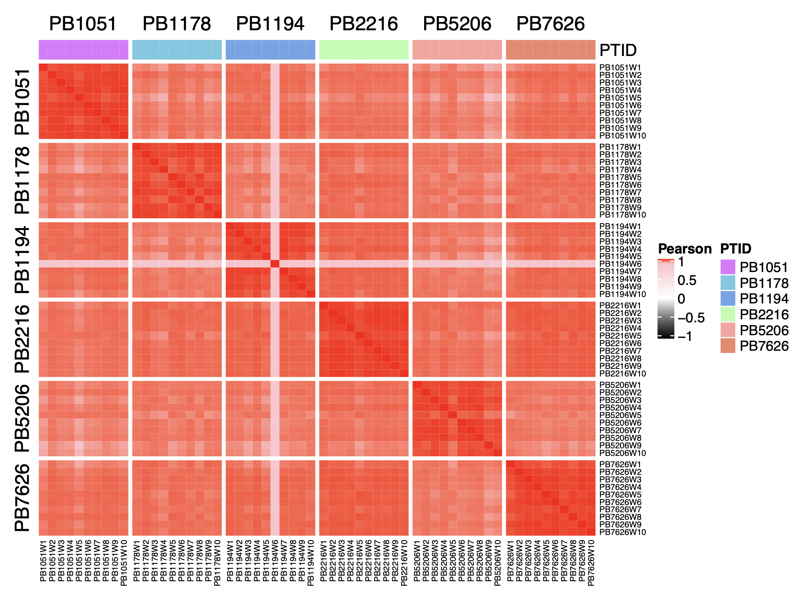
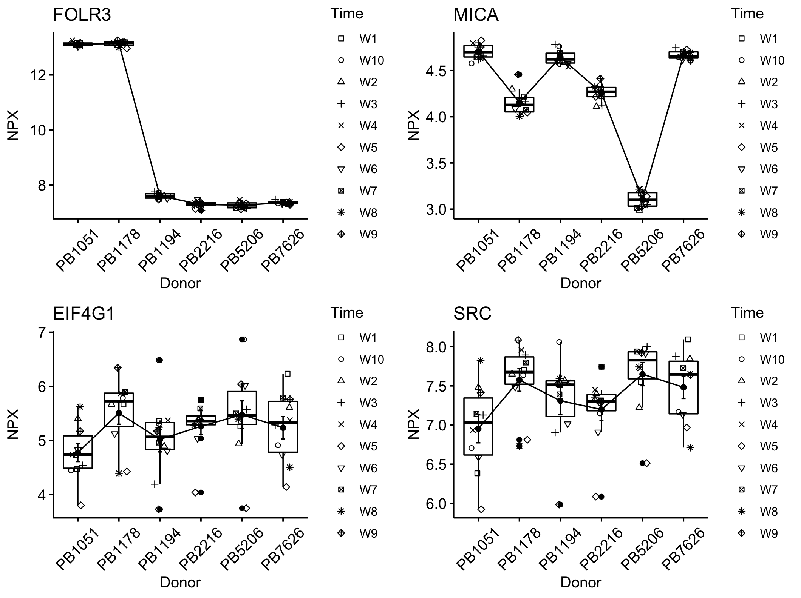
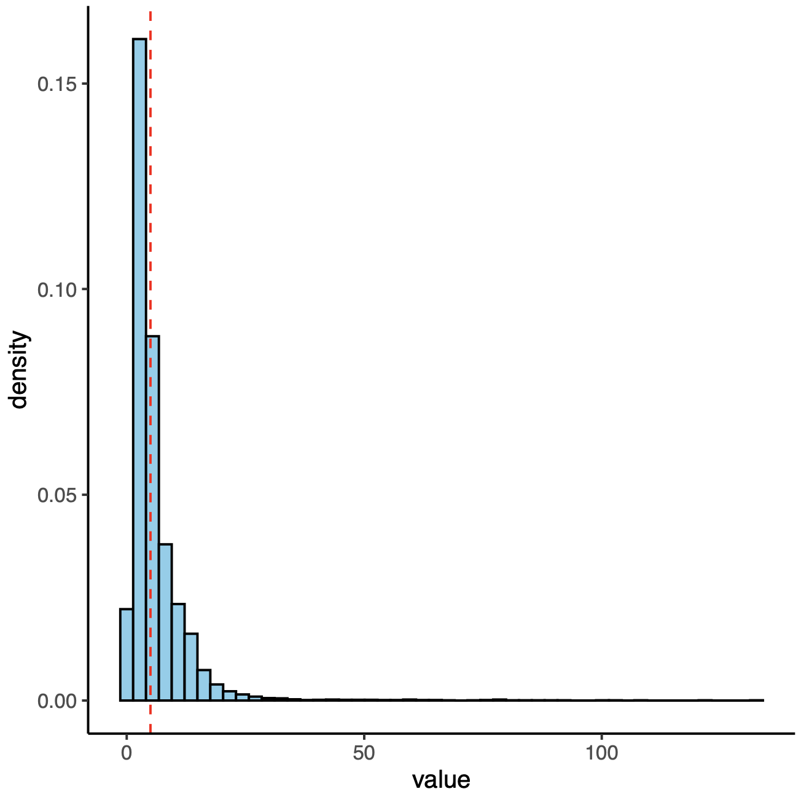
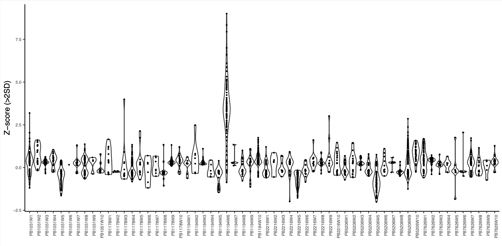
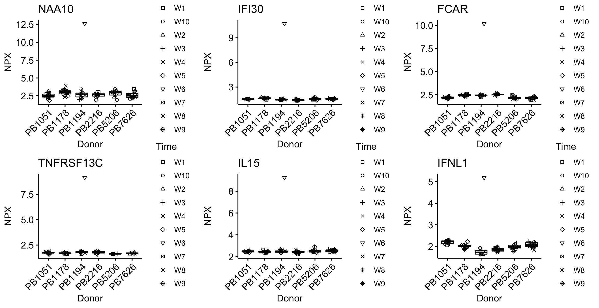
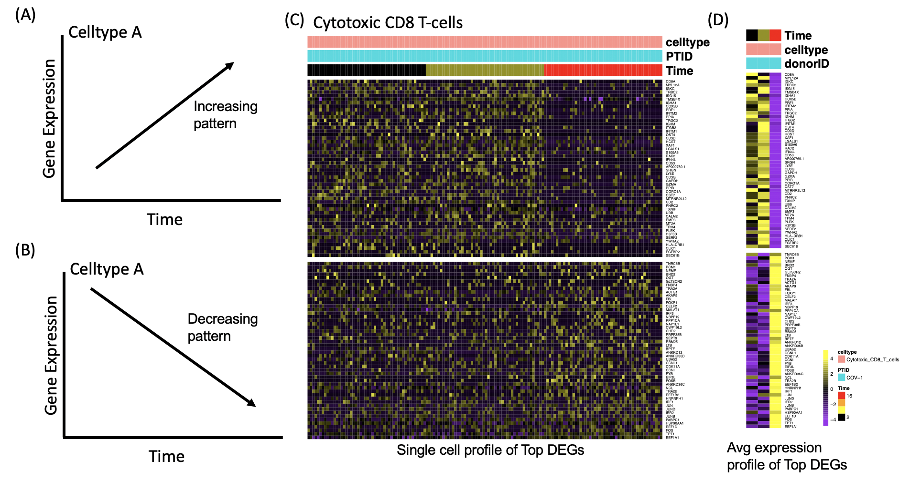

README for longitudinalDynamics
===============

* * *

Table of Contents
-----------------

* [Introduction](#introduction)
* [Install package and load library](#library)
* [Quick Usage (Longitudinal data)](#usage)
    * [Plasma proteome](#olink)
    * [Flow cell-proportion](#flow)
    * [Blood count data](#cbc)
    * [Single cell RNA data](#scrna)
    * [Single cell ATAC data](#scatac)
* [Tutorials](#example-main)
    * [Tutorial-1: Plasma proteome longitudinal data](#example1)
    * [Tutorial-2: scRNA longitudinal data](#example2)
    * [Tutorial-3: scATAC longitudinal data](#example3)
    * [Tutorial-4: CNP0001102 data longitudinal data](#example4)
    * [Tutorial-5: Differential Genes from longitudinal data](#example5)
* [Authors](#authors)
* [License](#license)

* * *

##  Introduction
LongitudinalDynamics `(longitudinalDynamics)` is a platform for anayzing longitudinal data from bulk as well as single cell. It allows to identify inter-, intra-donor variations in genes over longitudinal time points. The analysis can be done on bulk expression dataset without known celltype information or single cell with celltype/user-defined groups. It allows to infer stable and variable features in given donor and each celltype (or user defined group). The outlier analysis can be performed to identify techinical/biological perturbed samples in donor/participant. Further, differential analysis can be performed to deciher time-wise changes in gene expression in a celtype.

      
Fig.1 General workflow and analysis schema of **LongitudinalDynamics**. It can work with longitudinal data obtained from bulk such as clinical, bulk RNAseq, proteomic or single cell dataset from scRNAseq, scATACseq and scADT.

##  Install package and load library

To install library, simply run
   
    install.packages("longitudinalDynamics_0.1.0.tar.gz", repos = NULL, type ="source")
    library("longitudinalDynamics")

##  Quick Usage (Longitudinal data)
###  Plasma proteome
    #Load Plasma proteomic expression (NPX) data
    load("data/Olink_NPX_log2_Protein.Rda")
    #Clinical Metdata/annotation
    load("data/data_Annotation.Rda")
    #Run longuitudinal analysis
    long_res <- longitudinalDynamics(metadata=ann, datamatrix=data, 
                         datatype="bulk", omics="Protein",
                         fileName="olink", features=c("PTID", "Time"), 
                         meanThreshold=1, cvThreshold=5,
                         outputDirectory="output")

###  Flow cell-proportion
    #Load Flow-proportion data
    load("data/Flow_matrix.Rda")
    #Clinical Metdata/annotation
    load("data/data_Annotation.Rda")
    #Run longuitudinal analysis
    long_res <- longitudinalDynamics(metadata=ann, datamatrix=data,
                         datatype="bulk", omics="Flow",
                         fileName="Flow", features=c("PTID", "Time"), 
                         meanThreshold=1, cvThreshold=5,
                         outputDirectory="output")

###  Blood count data
    #Load CBC data
    load("data/CBC_matrix.Rda")
    #Clinical Metdata/annotation
    load("data/data_Annotation.Rda")
    #Run longuitudinal analysis
    long_res <- longitudinalDynamics(metadata=ann, datamatrix=data, 
                         datatype="bulk", omics="CBC",
                         fileName="CBC", features=c("PTID", "Time"), 
                         meanThreshold=1, cvThreshold=5,
                         outputDirectory="output")

###  Single cell RNA data
    #Seurat object
    pbmc <- readRDS("data/scRNA-PBMC-longitudinaldata.RDS")
    #Clinical Metdata/annotation
    load("data/data_Annotation.Rda")
    metadata=ann
    
    #Celltypes observed
    cell_type <- c("CD4_Naive","CD4_TEM","CD4_TCM","CD4_CTL","CD8_Naive","CD8_TEM","CD8_TCM","Treg","MAIT","gdT","dnT", 
                   "CD4_Proliferating", "CD8_Proliferating","NK_Proliferating",
                   "NK", "NK_CD56bright",
                   "B_naive", "B_memory", "B_intermediate","Plasmablast",
                   "CD14_Mono","CD16_Mono",
                   "cDC1","cDC2","pDC","ASDC",
                   "Platelet","Eryth", "ILC","HSPC","Doublet")
    #Selected celltypes (manuscript) based on proportions >5%
    group_oi <- c("CD4_Naive","CD4_TEM","CD4_TCM","CD4_CTL","CD8_Naive","CD8_TEM","CD8_TCM","Treg","MAIT","gdT",
                  "NK", "NK_CD56bright",
                  "B_naive", "B_memory", "B_intermediate",
                  "CD14_Mono","CD16_Mono",
                  "cDC2","pDC")
    
    #Run longuitudinal analysis
    long_res <- longitudinalDynamics(metadata=ann, scrnaObj=pbmc, datatype="singlecell", omics="rna",
                         fileName="scrna", features=c("PTID", "Time"), 
                         meanThreshold=0.1, cvThreshold=10,
                         avgGroup="celltype",
                         housekeeping_genes=c("GAPDH", "ACTB"),
                         group_oi=group_oi,
                         nPC=15,
                         donorThreshold=4, groupThreshold=40, topFeatures=25,
                         method=c("intra-donor","inter-donor"),
                         outputDirectory="output")
    
###  Single cell ATAC data
    #Load archR based genescore matrix
    load("load("data/scATAC-genescore_archr.Rda")
    #Clinical Metdata/annotation
    load("data/data_Annotation.Rda")
    
    #Run longuitudinal analysis
    long_res <- longitudinalDynamics(metadata=ann, atacObj=atacObj, datatype="singlecell", omics="atac",
                                     fileName="scatac", features=c("PTID", "Time", "group"), 
                                     meanThreshold=0.1, cvThreshold=10, celllabel=FALSE,
                                     coding_genes=FALSE,
                                     housekeeping_genes=c("GAPDH", "ACTB"), 
                                     #group_oi=group_oi,
                                     nPC=15,
                                     donorThreshold=4, groupThreshold=40, topFeatures=25,
                                     method=c("intra-donor","inter-donor"),
                                     outputDirectory="output")

##  Tutorials
###  Tutorial-1: Plasma proteome [Bulk dataset]

This tutorial allows users to explore bulk plasma proteome measured from 6 healthy donors over 10 timepoints. Plasma proteomic data available at github. 1. [Olink_NPX_log2_Protein.Rda](https://github.com/aifimmunology/longitudinalDynamics/blob/main/data/Olink_NPX_log2_Protein.Rda) (Normalized protein expression data) 2. [data_Annotation.Rda](https://github.com/aifimmunology/longitudinalDynamics/blob/main/data/data_Annotation.Rda) (clinical metadata). Longitudinal dataset includes 6 donors (3 male and 3 females). PBMC samples were collected from 6 donors over 10 weeks. To interrogate longitudinal data, please follow following steps.

#### 1.1: Load Library
   
    #Load Library
    library("longitudinalDynamics")
    library("Hmisc")
    library("ggpubr")
    
#### Load data and assign paramaters

    load("Olink_NPX_log2_Protein.Rda")
    load("data_Annotation.Rda")
    #assign rownames with sample name
    row.names(ann) <- ann$Sample
    #Parameters
    metadata=ann
    datamatrix=data
    features=c("PTID", "Time")
    meanThreshold=1
    cvThreshold=5
    housekeeping_genes <- c("GAPDH", "ACTB")
    
#### Create output directory

    outputDirectory <- "output"
    filePATH <- paste(getwd(), "/",outputDirectory, sep="")
    dir.create(file.path(getwd(), outputDirectory), showWarnings = FALSE)
    
#### Sample overlap

    overlap <- intersect(metadata$Sample, colnames(datamatrix))
    metadata <- metadata[overlap,]
    datamatrix <- data.frame(datamatrix, check.names = F, stringsAsFactors = F)
    datamatrix <- datamatrix[,overlap]

#### 1.2:  Check data
#### PCA Plot

    row.has.na <- apply(datamatrix,1,function(x){any(is.na(x))})
    datamatrix_nonNA <- datamatrix[!row.has.na,]
    res.pca <- prcomp(t(datamatrix_nonNA),  center=T, scale = TRUE)
    library("factoextra")
    plot1 <- fviz_pca_ind(res.pca, col.ind = metadata$PTID, geom.ind =c("point", "text"),  labelsize = 3, addEllipses=FALSE, ellipse.level=0.95) +
             theme(axis.text.x=element_text(size=12, color="black"), axis.text.y=element_text(size=12, color="black"), legend.position = "none") +
             theme_classic()
    print(plot1)

#### Sample variability (Correlation)

    cor_mat <- rcorr(as.matrix(datamatrix_nonNA), type="pearson")
    res <- cor_mat$r
    #Plot heatmap
    ha_col <- HeatmapAnnotation(df=data.frame(PTID=metadata$PTID))
    ht1 <- Heatmap(data.matrix(res), cluster_rows =F,  
               cluster_columns = F,
               row_split = as.character(metadata$PTID), column_split = as.character(metadata$PTID),
               na_col = "grey", col = colorRamp2(c(-1,0,0.9,1), c("black","white","pink","red")),
               row_names_max_width=unit(10, "cm"),
               column_names_gp = gpar(fontsize = 6), row_names_gp = gpar(fontsize =6),
               top_annotation = ha_col,
               heatmap_legend_param = list(title = "Pearson",heatmap_legend_side = "right") )
    draw(ht1)
    
      

#### Remove genes with >40%NAs (optional)

    row.na <- apply(datamatrix,1,function(x) { sum(is.na(x)) })
    row.non.na <- row.na[row.na < (0.4*ncol(datamatrix))] #select features with NAs <40%
    datamatrix <- datamatrix[names(row.non.na),]
    rowN <- data.frame(row.names(datamatrix), stringsAsFactors = F)

#### 1.3:  Features contributing towards donor variations
#### Variance decomposition

    lmem_res <- lmeVariance(ann=metadata, mat=datamatrix, features=features, meanThreshold=meanThreshold)

      

    
    res <- lmem_res[,c("PTID","Time","Residual")]
    colnames(res) <- c("donor","week","Residuals")
    res <- res*100 #in percentage
    head(res)
    
    #Features      donor      week  Residuals
    #FOLR3   99.90070 0.0000000 0.09930098
    #GH2     99.49856 0.0000000 0.50144042
    #PSPN    99.26882 0.1021076 0.62906798
    #CDHR2   99.07933 0.1157406 0.80493162
    #SSC4D   98.82794 0.0000000 1.17206000
    #XPNPEP2 98.67628 0.0000000 1.32372323
    
#### Donor-specific variance contrubuting features
    
    df1 <- filter(res, donor>week & Residuals < 50)
    df1 <- df1[order(df1$donor, decreasing = T),]
    df <- melt(data.matrix(df1[1:15,]))
    df$Var2 <- factor(df$Var2, levels = rev(c("donor","week", "Residuals")))
    df$Var1 <- factor(df$Var1, levels = rev(unique(df$Var1)))
    p1 <- ggplot(df, aes(x=Var1, y=value, fill=Var2)) +
        geom_bar(stat="identity", position="stack") +
        scale_fill_manual(values = c("donor"="#C77CFF", "celltype"="#00BFC4", "week"="#7CAE00", "Residuals"="grey")) +
        theme_bw() + theme(axis.text.x = element_text(angle=90, hjust = 0.5, vjust = 1),legend.position = "right") +
        coord_flip()
    print(p1)
    
      

#### Plot the variables

    genelist <- c("FOLR3", "MICA", "EIF4G1", "SRC")
    uniSample <- as.character(unique(metadata$PTID))
    splots <- list()
    for(i in 1:length(genelist)) {
      geneName <- genelist[i]
      df <- data.frame(exp=as.numeric(datamatrix[geneName,]), metadata, stringsAsFactors = F)
      df$PTID <- factor(df$PTID, levels = uniSample)
      plot1 <- ggpubr::ggline(df, x = "PTID", y = "exp", 
                add.params = list(shape="Time"), add = c("mean_se", "jitter", "boxplot"), 
                ylab = "NPX", xlab = "Donor", title = geneName, legend = "none", 
                outlier.shape = NA) + scale_shape_manual(values = 0:10)
      splots[[i]] <- plot1
    }
    plot_grid(plotlist=splots, ncol= 3, align="hv")

      

#### 1.4:  Intra-donor variations over time
#### CV vs Mean

    cv_res <- cvCalcBulk(mat=datamatrix, ann=metadata, meanThreshold=1, cvThreshold=5)

      
      

    CV <- cv_res$CV
    variable_genes <- cv_res$variable_genes
    stable_genes <- cv_res$stable_genes

#### 1.5:  Outlier analysis
#### Calculate IQR

    IQR_res <- iqrBulk(ann=metadata, mat=datamatrix)

      

#### IQR Plot
    
    df <- melt(data.matrix(IQR_res))
    df <- df[df$value != 0,]
    df <- df[!is.na(df$Var1),]
    df <- df[order(df$value, decreasing = T),]
    head(df)
    
    #Var1     Var2    value
    #NAA10 PB1194W6 9.003908
    #IFI30 PB1194W6 8.340474
    #PRTFDC1 PB1194W6 7.946629
    #FCAR PB1194W6 7.004890
    #TNFRSF13C PB1194W6 6.605767
    #DPEP2 PB1194W6 6.595705
    
    plot1 <- ggplot(df, aes(x=Var2, y=value)) +
        geom_violin(scale="width") +
        #geom_boxplot(width=0.1, fill="white") +
        labs(x="", y="Z-score (>2SD)") +
        ggforce::geom_sina(size=0.5) +
        theme_classic() + theme(axis.text.x = element_text(angle=90, hjust = 1, vjust = 1, size=6), axis.text.y = element_text(size=6), legend.position = "right")
    print(plot1)

#### Gene plot (probable outliers)

    genelist <- c("NAA10", "IFI30", "FCAR", "TNFRSF13C", "IL15", "IFNL1")
    splots <- list()
    for(i in 1:length(genelist)) {
       geneName <- genelist[i]
       df <- data.frame(exp=as.numeric(datamatrix[geneName,]), metadata, stringsAsFactors = F)
       df$PTID <- factor(df$PTID, levels = uniSample)
       plot1 <- ggline(df, x = "PTID", y = "exp", add.params = list(shape="Time"), add = c("mean_se", "jitter"), ylab = "NPX", xlab = "Donor", title = geneName, legend = "right", outlier.shape = NA) +
       scale_shape_manual(values = 0:10) + theme(axis.text.x = element_text(angle=45, hjust = 1, vjust = 1))
       splots[[i]] <- plot1
    }
    plot_grid(plotlist=splots, ncol= 3, align="hv")

      
    

###  Tutorial-2: scRNA longitudinal data (n=4 and 6 weeks follow-up)

This tutorial allows users to explore single cell RNAseq data measured from 4 healthy donors over 6 timepoints (week 2-7). Single cell data available at **GEOXXX**. (1) pbmc_longitudinal_data (Normalized scRNA seurat object) (2) data_Annotation.Rda (clinical metadata). Longitudinal dataset have 4 donors (2 male and 2 females). Please follow following steps.

#### 2.1: Load Library
   
    #Load Library
    library("longitudinalDynamics")
    library("Hmisc")
    library("ggpubr")
    
#### Load data and assign paramaters

    #scRNA seurat object
    pbmc <- readRDS("data/01-scRNA-PBMC-FinalData.RDS")
    metaData <- pbmc@meta.data
    pbmc@meta.data$Sample <- pbmc@meta.data$orig.ident
    #UMAP plot
    p1 <- DimPlot(object = pbmc, reduction = 'umap', group.by = "Sample", label = F)
    p2 <- DimPlot(object = pbmc, reduction = 'umap', group.by = "celltype", label = F)
    print(plot_grid(p1, p2, align="hv", ncol=2))

#### 

    #Clinical metadata/annotation
    load("data/data_Annotation.Rda")
    metadata=ann

    #Parameters
    dataObj <- pbmc
    features=c("PTID", "Time") 
    avgGroup="celltype"
    housekeeping_genes <- c("GAPDH", "ACTB")

    #Celltypes to be considered
    cell_type <- sort(unique(pbmc@meta.data$celltype))
    group_oi <- c("CD4_Naive","CD4_TEM","CD4_TCM","CD4_CTL","CD8_Naive","CD8_TEM","CD8_TCM","Treg","MAIT","gdT",
              "NK", "NK_CD56bright",
              "B_naive", "B_memory", "B_intermediate",
              "CD14_Mono","CD16_Mono",
              "cDC2","pDC")
    
#### Create output directory

    outputDirectory <- "output"
    filePATH <- paste(getwd(), "/",outputDirectory, sep="")
    dir.create(file.path(getwd(), outputDirectory), showWarnings = FALSE)
    
#### Sample overlap

    overlap <- intersect(metadata$Sample, dataObj@meta.data$Sample)
    metadata <- metadata[overlap,]
    #in-case subset of samples only
    dataObj <- subset(x = dataObj, subset = Sample %in% overlap)
 
#### 2.2: Aggregate data at celltypes (psuedo-bulk)
#### For single cell data merge annotation and single cell metadata

    metaData <- dataObj@meta.data
    metadata1 <- metadata[metaData$Sample,]
    metaData <- cbind(metaData, metadata1)
    dataObj@meta.data <- metaData

#### Define sample group and Calculate average expression

    dataObj@meta.data$Sample_group <- paste(dataObj@meta.data$Sample, dataObj@meta.data[,avgGroup], sep=":")
    dataObj@meta.data$Sample_group <- gsub(" ", "_", dataObj@meta.data$Sample_group)
    metaData <- dataObj@meta.data
    
#### Calculate average expression across group/celltype
    
    Idents(dataObj) <- "Sample_group"
    table(Idents(dataObj))
    scrna_avgmat <- avgExpCalc(dataObj=dataObj, group.by="Sample_group")

#### Keep genes with avgExpression > zero

    rowDF <- rowSums(scrna_avgmat)
    rowDF <- rowDF[rowDF > 0]
    mat <- scrna_avgmat[names(rowDF),]

#### Create annotation

    cn <- data.frame(Sample_group=colnames(mat))
    temp <- data.frame(do.call(rbind, strsplit(cn$Sample_group, split = ":")), stringsAsFactors = F)
    cn <- data.frame(cn, Sample=temp$X1, group=temp$X2, stringsAsFactors = F)
    row.names(cn) <- cn$Sample_group
    cn <- merge(cn, metadata, by="Sample", all=TRUE)
    cn <- cn[!is.na(cn$Sample_group),]
    row.names(cn) <- cn$Sample_group
    ann <- cn
    ann$Sample_group_i <- paste(ann$group, ann$PTID, sep=":")
    rm(cn)

#### Final matrix

    Overlap <- intersect(colnames(mat), row.names(ann))
    ann <- ann[Overlap,]
    mat <- mat[,Overlap]
    write.table(sort(unique(ann$group)), file=paste(filePATH,"/",fileName,"-group.txt", sep=""), row.names = F, col.names=F, quote=F)

#### 2.3: CV profile

    exp_profile <- cvSampleprofile(mat=mat, ann=ann)
    #Mean Plot
    ggplot(exp_profile, aes(x=mean)) +
      geom_histogram(binwidth=0.1, color="black", fill="white") +
      scale_x_continuous(trans='log10')

    ggplot(exp_profile, aes(x=mean)) +
      geom_histogram(binwidth=0.1, color="black", fill="white") +
      scale_x_continuous(trans='log10') +
      facet_wrap(~group)

    #CV plot
    ggplot(exp_profile, aes(x=cv)) +
      geom_histogram(binwidth=1, color="black", fill="white")
    
    #Housekeeping genes data
    exp_profile <- exp_profile[exp_profile$gene %in% c("ACTB","GAPDH"),]
    ggplot(exp_profile, aes(x=mean, y=cv)) + geom_point() +
      facet_wrap(~gene)

#### 2.4: Features contributing towards donor variations
#### Variance decomposition

    meanThreshold <- 0.1
    lmem_res <- lmeVariance(ann=ann, mat=mat, features=c(features,"group"), meanThreshold=meanThreshold, fileName=fileName, filePATH=filePATH)
    res <- lmem_res[,c("PTID","Time","group","Residual")]
    colnames(res) <- c("donor","week","celltype","Residuals")
    res <- res*100 #in percentage
    
#### Donor-specific variance

    df1 <- filter(res, donor>week & donor>celltype & Residuals < 50)
    df1 <- df1[order(df1$donor, decreasing = T),]
    df <- melt(data.matrix(df1))
    df$Var2 <- factor(df$Var2, levels = rev(c("donor","week", "celltype", "Residuals")))
    df$Var1 <- factor(df$Var1, levels = rev(unique(df$Var1)))
    p1 <- ggplot(df, aes(x=Var1, y=value, fill=Var2)) +
      geom_bar(stat="identity", position="stack") +
      scale_fill_manual(values = c("donor"="#C77CFF", "celltype"="#00BFC4", "week"="#7CAE00", "Residuals"="grey")) +
      theme_bw() + theme(axis.text.x = element_text(angle=90, hjust = 0.5, vjust = 1),legend.position = "right") +
      coord_flip()
    print(p1)  

#### Plot the variables

    genelist <- c("MTRNR2L8", "XIST", "RPS4Y1", "RPS26",
                  "JUN", "DAXX", "FOSB", "STAT1",
                  "LILRA4", "CLEC9A", "CST3", "BANK1")
    plotFunction <- function(ann, mat, geneName) {
      df <- data.frame(exp=as.numeric(mat[geneName,]), ann, stringsAsFactors = F)
      wk <- c("W2","W3","W4","W5","W6","W7")
      col <- colorRampPalette(c("cyan", "grey", "black"))(6)
      names(col) <- wk
      df$Time <- factor(df$Time, levels = wk)
      plot1 <- ggplot(df, aes(x=PTID, y=exp, fill=Time)) +
          #geom_bar(stat="identity", position="dodge") +
          #geom_point(position=position_dodge(width=0.9), aes(y=exp), size=0.2) +
          geom_boxplot(outlier.size = 0.1) +
          scale_fill_manual(values = col) +
          labs(x="", y="RNA expression", title=geneName) +
          theme_classic() + theme(axis.text.x = element_text(angle=0, hjust = 0.5, vjust = 1),legend.position = "right")
        
      plot2 <- ggplot(df, aes(x=PTID, y=exp, fill=Time)) +
          #geom_bar(stat="identity", position="dodge") +
          #geom_point(position=position_dodge(width=0.9), aes(y=exp), size=0.2) +
          geom_boxplot(outlier.size = 0.1) +
          scale_fill_manual(values = col) +
          facet_wrap(~group) +
          labs(x="", y="RNA expression", title=geneName) +
          theme_classic() + theme(axis.text.x = element_text(angle=90, hjust = 0.5, vjust = 1),legend.position = "right")
      return(list(plot1=plot1, plot2=plot2))
    }
    
    plots <- plotFunction(ann, mat, geneName="MTRNR2L8")
    print(plots$plot1)
    plots <- plotFunction(ann, mat, geneName="LILRA4")
    print(plots$plot2)
    
#### 2.5: Intra-donor variations over time
#### Calculate CV

    meanThreshold=0.1
    cvThreshold=10
    cv_res <- cvCalcSC(mat=mat, ann=ann, meanThreshold=meanThreshold, cvThreshold=cvThreshold, housekeeping_genes=housekeeping_genes, filePATH=filePATH, fileName="scrna")

#### Find stable and variable features in longitudinal data

    donorThreshold <- 4
    groupThreshold <- 40 #number of donors * number of celltypes/2 (4x19/2)
    topFeatures <- 25
    var_gene <- VarFeatures(ann=ann, group_oi=group_oi, meanThreshold=meanThreshold, cvThreshold=cvThreshold, donorThreshold=donorThreshold, groupThreshold=groupThreshold, topFeatures=topFeatures, filePATH=filePATH, fileName=fileName)

    stable_gene <- StableFeatures(ann=ann, group_oi=group_oi, meanThreshold=meanThreshold, cvThreshold=cvThreshold, donorThreshold=donorThreshold, groupThreshold=groupThreshold, topFeatures=topFeatures, filePATH=filePATH, fileName=fileName)

#### UMAP Plot

    nPC <- 15
    plot1 <- DimPlot(object = pbmc, reduction = 'umap', group.by = "celltype", label = T)
    rnaObj <- dimUMAPPlot(rnaObj=dataObj, nPC=nPC, gene_oi=var_gene, groupName=avgGroup, plotname="variable", filePATH=filePATH, fileName=fileName)
    rnaObj <- dimUMAPPlot(rnaObj=dataObj, nPC=nPC, gene_oi=stable_gene, groupName=avgGroup, plotname="stable", filePATH=filePATH, fileName=fileName)

#### gene Plot

    plots <- genePlot(ann=ann, data=mat, geneName="IL7R", groupName="group")

#### Circular gene expression plot

    load("output/scrna-CV-allgenes-raw.Rda")
    geneList <- c("IL32","CCL5","TCF7","IL7R","LEF1") #T-cell
    res <- genecircosPlot(data=cv_res, geneList=geneList, group_oi=group_oi)

###  Tutorial-3: scATAC Longitudinal data (n=4 and 6 weeks follow-up)
This tutorial allows users to explore single cell ATACseq genscore data measured from 4 healthy donors over 6 timepoints (week 2-7). Single cell ATAC data available at GEOXXX. (1) pbmc_scatac_archr_genescore_longitudinal_data (2) data_Annotation.Rda (clinical metadata). Longitudinal dataset have 4 donors (2 male and 2 females). Please follow following steps.

#### 3.1: Load Library

    #Load Library
    library("longitudinalDynamics")
    library("Hmisc")
    library("ggpubr")

#### Load data and assign paramaters

    #scATAC object
    load("data/pbmc_scatac_archr_genescore_longitudinal_data.Rda")
    #Clinical metadata/annotation
    load("data/data_Annotation.Rda")
    metadata=ann

#### Parameters

    metadata <- ann
    atacObj <- log2(scatac_gm+1)
    housekeeping_genes <- c("GAPDH", "ACTB")
    #Celltypes to be considered
    group_oi <- c("CD4_Naive","CD4_TEM","CD4_TCM","CD4_CTL","CD8_Naive","CD8_TEM","CD8_TCM","Treg","MAIT","gdT",
          "NK", "NK_CD56bright",
          "B_naive", "B_memory", "B_intermediate",
          "CD14_Mono","CD16_Mono",
          "cDC2","pDC")

#### Create output directory

    outputDirectory <- "output"
    filePATH <- paste(getwd(), "/",outputDirectory, sep="")
    dir.create(file.path(getwd(), outputDirectory), showWarnings = FALSE)

#### Sample overlap

    temp <- data.frame(do.call(rbind, strsplit(colnames(atacObj), split = ":")), stringsAsFactors = F)
    cn <- data.frame(id=colnames(atacObj), Sample=temp$X1, group=temp$X2, check.names=F, stringsAsFactors = F)
    cn <- cn[cn$Sample %in% metadata$Sample,]
    overlap <- as.character(unique(cn$Sample))
    atac_overlap <- cn$id
    metadata <- metadata[overlap,]
    atacObj <- atacObj[,atac_overlap]

#### Keep genes with avgExpression > zero

    rowDF <- rowSums(atacObj)
    rowDF <- rowDF[rowDF > 0]
    mat <- atacObj[names(rowDF),]

#### Create annotation

    cn <- data.frame(Sample_group=colnames(mat))
    temp <- data.frame(do.call(rbind, strsplit(cn$Sample_group, split = ":")), stringsAsFactors = F)
    cn <- data.frame(cn, Sample=temp$X1, group=temp$X2, stringsAsFactors = F)
    row.names(cn) <- cn$Sample_group
    cn <- merge(cn, metadata, by="Sample", all=TRUE)
    cn <- cn[!is.na(cn$Sample_group),]
    row.names(cn) <- cn$Sample_group
    ann <- cn
    ann$Sample_group_i <- paste(ann$group, ann$PTID, sep=":")
    rm(cn)

#### Final matrix

    Overlap <- intersect(colnames(mat), row.names(ann))
    ann <- ann[Overlap,]
    mat <- mat[,Overlap]
    write.table(sort(unique(ann$group)), file=paste(filePATH,"/",fileName,"-group.txt", sep=""), row.names = F, col.names=F, quote=F)

#### 3.2: CV profile
#### CV profile

    exp_profile <- cvSampleprofile(mat=mat, ann=ann)

#### Mean Plot

    ggplot(exp_profile, aes(x=mean)) +
      geom_histogram(binwidth=0.1, color="black", fill="white") +
      scale_x_continuous(trans='log10')

    ggplot(exp_profile, aes(x=mean)) +
      geom_histogram(binwidth=0.1, color="black", fill="white") +
      scale_x_continuous(trans='log10') +
      facet_wrap(~group)

    ggplot(exp_profile, aes(x=cv)) +
      geom_histogram(binwidth=1, color="black", fill="white")
    
    #Housekeeping genes data
    exp_profile <- exp_profile[exp_profile$gene %in% c("ACTB","GAPDH"),]
    ggplot(exp_profile, aes(x=mean, y=cv)) + geom_point() +
      facet_wrap(~gene)

#### 3.3: Features contributing towards donor variations

    meanThreshold <- 0.1
    lmem_res <- lmeVariance(ann=ann, mat=mat, features=c(features,"group"), meanThreshold=meanThreshold, fileName=fileName, filePATH=filePATH)
    res <- lmem_res[,c("PTID","Time","group","Residual")]
    colnames(res) <- c("donor","week","celltype","Residuals")
    res <- res*100 #in percentage
    
#### Donor-specific

    df1 <- filter(res, donor>week & donor>celltype & Residuals < 50)
    df1 <- df1[order(df1$donor, decreasing = T),]
    df <- melt(data.matrix(df1[1:15,]))
    df$Var2 <- factor(df$Var2, levels = rev(c("donor","week", "celltype", "Residuals")))
    df$Var1 <- factor(df$Var1, levels = rev(unique(df$Var1)))
    p1 <- ggplot(df, aes(x=Var1, y=value, fill=Var2)) +
      geom_bar(stat="identity", position="stack") +
      scale_fill_manual(values = c("donor"="#C77CFF", "celltype"="#00BFC4", "week"="#7CAE00", "Residuals"="grey")) +
      theme_bw() + theme(axis.text.x = element_text(angle=90, hjust = 0.5, vjust = 1),legend.position = "right") +
      coord_flip()
    p1
    
#### Week-specific

    df2 <- filter(res, donor<week & week>celltype)
    df2 <- df2[order(df2$week, decreasing = T),]
    #select Top15
    df2 <- df2[1:15,]
    df <- melt(data.matrix(df2))
    df$Var2 <- factor(df$Var2, levels = rev(c("week", "donor","celltype", "Residuals")))
    df$Var1 <- factor(df$Var1, levels = rev(unique(df$Var1)))
    p2 <- ggplot(df, aes(x=Var1, y=value, fill=Var2)) +
      geom_bar(stat="identity", position="stack") +
      scale_fill_manual(values = c("donor"="#C77CFF", "celltype"="#00BFC4", "week"="#7CAE00", "Residuals"="grey")) +
      theme_bw() + theme(axis.text.x = element_text(angle=90, hjust = 0.5, vjust = 1),legend.position = "right") +
      coord_flip()
    p2
    
#### celltype-specific

    df3 <- filter(res, celltype>donor & celltype>week & Residuals < 50)
    df3 <- df3[order(df3$celltype, decreasing = T),]
    #select Top15
    df3 <- df3[1:15,]
    df <- melt(data.matrix(df3))
    df$Var2 <- factor(df$Var2, levels = rev(c("donor","week", "celltype", "Residuals")))
    df$Var1 <- factor(df$Var1, levels = rev(unique(df$Var1)))
    p3 <- ggplot(df, aes(x=Var1, y=value, fill=Var2)) +
      geom_bar(stat="identity", position="stack") +
      scale_fill_manual(values = c("donor"="#C77CFF", "celltype"="#00BFC4", "week"="#7CAE00", "Residuals"="grey")) +
      theme_bw() + theme(axis.text.x = element_text(angle=90, hjust = 0.5, vjust = 1),legend.position = "right") +
      coord_flip()
    p3
    
    #Plot
    plot_grid(p1,p2,p3, align="hv", ncol=3)

    #Top genes
    genelist <- c("FIRRE", "XIST", "RHD", "GSTM1", "ZNF705D", "LOC105376805",
              "DPP6", "THSD7A", "OPCML", "CACNA2D3", "PTPRD", "NELL1",
              "SPIB", "KLF4", "IFI30", "FOSL2", "TARP", "PRF1")

    plotFunction <- function(ann, mat, geneName) {
      df <- data.frame(exp=as.numeric(mat[geneName,]), ann, stringsAsFactors = F)
      wk <- c("W2","W3","W4","W5","W6","W7")
      col <- colorRampPalette(c("cyan", "grey", "black"))(6)
      names(col) <- wk
      df$Time <- factor(df$Time, levels = wk)
      plot1 <- ggplot(df, aes(x=PTID, y=exp, fill=Time)) +
          #geom_bar(stat="identity", position="dodge") +
          #geom_point(position=position_dodge(width=0.9), aes(y=exp), size=0.2) +
          geom_boxplot(outlier.size = 0.1) +
          scale_fill_manual(values = col) +
          labs(x="", y="RNA expression", title=geneName) +
          theme_classic() + theme(axis.text.x = element_text(angle=0, hjust = 0.5, vjust = 1),legend.position = "right")
        
      plot2 <- ggplot(df, aes(x=PTID, y=exp, fill=Time)) +
          #geom_bar(stat="identity", position="dodge") +
          #geom_point(position=position_dodge(width=0.9), aes(y=exp), size=0.2) +
          geom_boxplot(outlier.size = 0.1) +
          scale_fill_manual(values = col) +
          facet_wrap(~group) +
          labs(x="", y="RNA expression", title=geneName) +
          theme_classic() + theme(axis.text.x = element_text(angle=90, hjust = 0.5, vjust = 1),legend.position = "right")
      return(list(plot1=plot1, plot2=plot2))
    }

    plots <- plotFunction(ann, mat, geneName="MTRNR2L8")
    print(plots$plot1)
    plots <- plotFunction(ann, mat, geneName="LILRA4")
    print(plots$plot2)

#### 3.4: Intra-donor variations over time

    Calculate CV
    meanThreshold=0.1
    cvThreshold=10
    cv_res <- cvCalcSC(mat=mat, ann=ann, meanThreshold=meanThreshold, cvThreshold=cvThreshold, housekeeping_genes=housekeeping_genes, filePATH=filePATH,     fileName=fileName)

#### Find stable and variable features in longitudinal data

    #Find stable and variable features in longitudinal data
    donorThreshold <- 4
    groupThreshold <- 22 #number of donors * number of celltypes/2 (5x15/2)
    topFeatures <- 25
    var_gene <- VarFeatures(ann=ann, group_oi=group_oi, meanThreshold=meanThreshold, cvThreshold=cvThreshold, donorThreshold=donorThreshold, groupThreshold=groupThreshold, topFeatures=topFeatures, filePATH=filePATH, fileName=fileName)
    stable_gene <- StableFeatures(ann=ann, group_oi=group_oi, meanThreshold=meanThreshold, cvThreshold=cvThreshold, donorThreshold=donorThreshold, groupThreshold=groupThreshold, topFeatures=topFeatures, filePATH=filePATH, fileName=fileName)

#### Gene Plot

    plots <- genePlot(ann=ann, data=mat, geneName="IL7R", groupName="group")

#### Circos plot

    load("output/scrna-CV-allgenes-raw.Rda")
    group_oi <- c("CD4_Naive","CD4_CTL","CD4_TCM","CD4_TEM",
              "CD8_Naive","CD8_TCM","CD8_TEM","Treg","MAIT","gdT",
              "B_intermediate","B_memory","B_naive",
              "NK", "NK_CD56bright",
              "CD14_Mono","CD16_Mono",
              "cDC2","pDC")

    geneList <- c("HLA-A","HLA-B","HLA-C","HLA-DRA","HLA-DPA1","HLA-DRB1")
    res <- genecircosPlot(data=cv_res, geneList=geneList, group_oi=group_oi)

#### 3.5: Comparing gene expression from scRNA and scATAC

    load("data/05-1-scATAC-averageExpression_Celltype_archr_score05.Rda")
    temp <- data.frame(do.call(rbind, strsplit(colnames(scatac_gm), split = ":")), stringsAsFactors = F)
    unique(temp$X2)

    load("data/scrna_avgmat.Rda")
    scrna_gm <- scrna_avgmat
    
    #Gene and sample oerlap
    geneOverlap <- intersect(row.names(scrna_gm), row.names(scatac_gm))
    sampleOverlap <- intersect(colnames(scrna_gm), colnames(scatac_gm))
    scrna_gm <- scrna_gm[geneOverlap, sampleOverlap]
    scatac_gm <- scatac_gm[geneOverlap, sampleOverlap]
    
    #Perform correltion
    cor_res <- lapply(geneOverlap,function(x) {
    res <- cor.test(as.numeric(scrna_gm[x,]), as.numeric(scatac_gm[x,]), method = "pearson")
      c(res$estimate, res$p.value)
    })
    cor_res <- do.call(rbind, cor_res)
    cor_res <- data.frame(gene=geneOverlap, cor_res, stringsAsFactors = F)
    colnames(cor_res) <- c("Gene", "cor", "pvalue")
    row.names(cor_res) <- cor_res$Gene
    cor_res <- cor_res[order(cor_res$cor, decreasing = T),]
    cor_res$FDR <- p.adjust(cor_res$pvalue, method = "BH")
    
    #Summary of correlation
    summary(cor_res$cor)
    cor_res$direction <- ifelse(cor_res$cor>=0, "pos", "neg")
    cor_res$sig <- ifelse(cor_res$FDR <=0.05, "sig", "non-sig")
    table(cor_res$direction)
    table(cor_res$direction, cor_res$sig)
    
    #Plot
    plot1 <- ggplot(cor_res, aes(x=cor, fill=direction)) +
        geom_histogram(bins=100) + theme_classic()
    print(plot1)

#### 3.6: Correlation across modality

    genelist <- c("HLA-A","HLA-B","HLA-C","HLA-DRA","HLA-DPA1","HLA-DRB1",
              "IRF1","IRF2","IRF3","IRF4","IRF5","IRF8",
              "IL32","IL7R","IL10RA","IL2RB","IL1B","IL18",
              "CXCR4","CXCR5","CXCR6","CXCL8","CXCL10","CXCL16",
              "JAK1","JAK2","JAK3","STAT2","STAT4","STAT6",
              "TNFRSF1B","TNFRSF13C","TNFRSF10B","TNFRSF25","TNFRSF11A", "TNFRSF17")

    splots <- list()
    for(i in 1:length(genelist)) {
       geneName <- genelist[i]
       dx <- data.frame(sample=sampleOverlap, x=as.numeric(scrna_gm[geneName,]), y=as.numeric(scatac_gm[geneName,]), stringsAsFactors = F)
       cn <- data.frame(do.call(rbind, strsplit(dx$sample, split = ":")), stringsAsFactors = F)
       dx$donor <- cn$X1
       dx$celltype <- cn$X2
       p1 <- ggplot(dx, aes(x=x, y=y)) + geom_point(aes(color=celltype)) + 
           #scale_color_manual(values=c("red"="red", "grey"="grey")) +
           labs(title=geneName) +
           labs(x="scRNA (Expression)", y="scATAC (genescore)") +
           ggpubr::stat_cor(method = "pearson") +
           theme_classic() + theme(legend.position = "right")

       p2 <- ggplot(dx, aes(x=x, y=y)) + geom_point(aes(color=celltype)) + 
           labs(title=geneName) +
           theme_classic() + labs(x="scRNA (Expression)", y="scATAC (genescore)") +
           facet_wrap(~celltype) + ggpubr::stat_cor(method = "pearson")
       print(p1)
       splots[[i]] <- p1
    }
    #Plot
    plot_grid(plotlist=splots, ncol= 6, align="hv")

###  Tutorial-4: CNP0001102 data
This tutorial allows users to explore single cell RNAseq data variability across COVID and FLU donors. PBMC from the patients were collected longitudinally. Single cell data from [Zhu et al. 2020](https://www.ncbi.nlm.nih.gov/pmc/articles/PMC7368915/) downloaded from [here](https://db.cngb.org/search/project/CNP0001102/). Metadata is downloaded from table and can be found in the [data](https://github.com/aifimmunology/longitudinalDynamics/tree/main/data). To infer variability (inter- and Intra-) and identify stable genes, please follow following steps.

#### 4.1: Load Library
   
    #Load Library
    library("longitudinalDynamics")
    library("Hmisc")
    library("ggpubr")
    
#### Load data and assign paramaters

    #scRNA
    pbmc <- readRDS(".data/CNP0001102_Final_nCoV_0716_upload.RDS")
    pbmc@meta.data$Sample <- pbmc@meta.data$batch
    pbmc@meta.data$celltype <- gsub(" ", "_", pbmc@meta.data$cell_type)
        
    metadata <- read.csv("data/CNP0001102-annotation.csv", stringsAsFactors = F)
    row.names(metadata) <- metadata$Sample

    #Exploring only COVID samples 
    metadata <- metadata[metadata$PTID %in% c("COV-1", "COV-2", "COV-3", "COV-4", "COV-5"),]
    #Exploring only FLU samples
    metadata <- metadata[metadata$PTID %in% c("IAV-1","IAV-2"),]
        
    #Parameters
    dataObj <- pbmc
    features=c("PTID", "Time") 
    avgGroup="celltype"
    housekeeping_genes <- c("GAPDH", "ACTB")
    cell_type <- sort(unique(pbmc@meta.data$celltype))
    
#### Create output directory

    outputDirectory <- "output"
    filePATH <- paste(getwd(), "/",outputDirectory, sep="")
    dir.create(file.path(getwd(), outputDirectory), showWarnings = FALSE)
    
#### Sample overlap

    overlap <- intersect(metadata$Sample, dataObj@meta.data$Sample)
    metadata <- metadata[overlap,]
    #in-case subset of samples only
    dataObj <- subset(x = dataObj, subset = Sample %in% overlap)
 
#### 4.2: Aggregate data at celltypes (psuedo-bulk)
#### For single cell data merge annotation and single cell metadata

    metaData <- dataObj@meta.data
    metadata1 <- metadata[metaData$Sample,]
    metaData <- cbind(metaData, metadata1)
    dataObj@meta.data <- metaData

#### Define sample group and Calculate average expression

    dataObj@meta.data$Sample_group <- paste(dataObj@meta.data$Sample, dataObj@meta.data[,avgGroup], sep=":")
    dataObj@meta.data$Sample_group <- gsub(" ", "_", dataObj@meta.data$Sample_group)
    metaData <- dataObj@meta.data
    
#### Calculate average expression across group/celltype
    
    Idents(dataObj) <- "Sample_group"
    table(Idents(dataObj))
    scrna_avgmat <- avgExpCalc(dataObj=dataObj, group.by="Sample_group")

#### Keep genes with avgExpression > zero

    rowDF <- rowSums(scrna_avgmat)
    rowDF <- rowDF[rowDF > 0]
    mat <- scrna_avgmat[names(rowDF),]

#### Create annotation

    cn <- data.frame(Sample_group=colnames(mat))
    temp <- data.frame(do.call(rbind, strsplit(cn$Sample_group, split = ":")), stringsAsFactors = F)
    cn <- data.frame(cn, Sample=temp$X1, group=temp$X2, stringsAsFactors = F)
    row.names(cn) <- cn$Sample_group
    cn <- merge(cn, metadata, by="Sample", all=TRUE)
    cn <- cn[!is.na(cn$Sample_group),]
    row.names(cn) <- cn$Sample_group
    ann <- cn
    ann$Sample_group_i <- paste(ann$group, ann$PTID, sep=":")
    rm(cn)

#### Final matrix

    Overlap <- intersect(colnames(mat), row.names(ann))
    ann <- ann[Overlap,]
    mat <- mat[,Overlap]
    write.table(sort(unique(ann$group)), file=paste(filePATH,"/",fileName,"-group.txt", sep=""), row.names = F, col.names=F, quote=F)

#### 4.3: CV profile

    exp_profile <- cvSampleprofile(mat=mat, ann=ann)
    #Mean Plot
    ggplot(exp_profile, aes(x=mean)) +
      geom_histogram(binwidth=0.1, color="black", fill="white") +
      scale_x_continuous(trans='log10')

    ggplot(exp_profile, aes(x=mean)) +
      geom_histogram(binwidth=0.1, color="black", fill="white") +
      scale_x_continuous(trans='log10') +
      facet_wrap(~group)

    #CV plot
    ggplot(exp_profile, aes(x=cv)) +
      geom_histogram(binwidth=1, color="black", fill="white")
    
    #Housekeeping genes data
    exp_profile <- exp_profile[exp_profile$gene %in% c("ACTB","GAPDH"),]
    ggplot(exp_profile, aes(x=mean, y=cv)) + geom_point() +
      facet_wrap(~gene)

#### 4.4: Features contributing towards donor variations
#### Variance decomposition

    meanThreshold <- 0.1
    lmem_res <- lmeVariance(ann=ann, mat=mat, features=c(features,"group"), meanThreshold=meanThreshold, fileName=fileName, filePATH=filePATH)
    res <- lmem_res[,c("PTID","Time","group","Residual")]
    colnames(res) <- c("donor","week","celltype","Residuals")
    res <- res*100 #in percentage
    
#### Donor-specific variance

    df1 <- filter(res, donor>week & donor>celltype & Residuals < 50)
    df1 <- df1[order(df1$donor, decreasing = T),]
    df <- melt(data.matrix(df1))
    df$Var2 <- factor(df$Var2, levels = rev(c("donor","week", "celltype", "Residuals")))
    df$Var1 <- factor(df$Var1, levels = rev(unique(df$Var1)))
    p1 <- ggplot(df, aes(x=Var1, y=value, fill=Var2)) +
      geom_bar(stat="identity", position="stack") +
      scale_fill_manual(values = c("donor"="#C77CFF", "celltype"="#00BFC4", "week"="#7CAE00", "Residuals"="grey")) +
      theme_bw() + theme(axis.text.x = element_text(angle=90, hjust = 0.5, vjust = 1),legend.position = "right") +
      coord_flip()
    print(p1)  

#### Plot the variables

    genelist <- c("MTRNR2L8", "XIST", "RPS4Y1", "RPS26",
                  "JUN", "DAXX", "FOSB", "STAT1",
                  "LILRA4", "CLEC9A", "CST3", "BANK1")
    plotFunction <- function(ann, mat, geneName) {
      df <- data.frame(exp=as.numeric(mat[geneName,]), ann, stringsAsFactors = F)
      wk <- c("W2","W3","W4","W5","W6","W7")
      col <- colorRampPalette(c("cyan", "grey", "black"))(6)
      names(col) <- wk
      df$Time <- factor(df$Time, levels = wk)
      plot1 <- ggplot(df, aes(x=PTID, y=exp, fill=Time)) +
          #geom_bar(stat="identity", position="dodge") +
          #geom_point(position=position_dodge(width=0.9), aes(y=exp), size=0.2) +
          geom_boxplot(outlier.size = 0.1) +
          scale_fill_manual(values = col) +
          labs(x="", y="RNA expression", title=geneName) +
          theme_classic() + theme(axis.text.x = element_text(angle=0, hjust = 0.5, vjust = 1),legend.position = "right")
        
      plot2 <- ggplot(df, aes(x=PTID, y=exp, fill=Time)) +
          #geom_bar(stat="identity", position="dodge") +
          #geom_point(position=position_dodge(width=0.9), aes(y=exp), size=0.2) +
          geom_boxplot(outlier.size = 0.1) +
          scale_fill_manual(values = col) +
          facet_wrap(~group) +
          labs(x="", y="RNA expression", title=geneName) +
          theme_classic() + theme(axis.text.x = element_text(angle=90, hjust = 0.5, vjust = 1),legend.position = "right")
      return(list(plot1=plot1, plot2=plot2))
    }
    
    plots <- plotFunction(ann, mat, geneName="MTRNR2L8")
    print(plots$plot1)
    plots <- plotFunction(ann, mat, geneName="LILRA4")
    print(plots$plot2)
    
#### 4.5: Intra-donor variations over time
#### Calculate CV

    meanThreshold=0.1
    cvThreshold=10
    cv_res <- cvCalcSC(mat=mat, ann=ann, meanThreshold=meanThreshold, cvThreshold=cvThreshold, housekeeping_genes=housekeeping_genes, filePATH=filePATH, fileName="scrna")

#### Find stable and variable features in longitudinal data

    donorThreshold <- 4
    groupThreshold <- 40 #number of donors * number of celltypes/2 (4x19/2)
    topFeatures <- 25
    var_gene <- VarFeatures(ann=ann, group_oi=group_oi, meanThreshold=meanThreshold, cvThreshold=cvThreshold, donorThreshold=donorThreshold, groupThreshold=groupThreshold, topFeatures=topFeatures, filePATH=filePATH, fileName=fileName)

    stable_gene <- StableFeatures(ann=ann, group_oi=group_oi, meanThreshold=meanThreshold, cvThreshold=cvThreshold, donorThreshold=donorThreshold, groupThreshold=groupThreshold, topFeatures=topFeatures, filePATH=filePATH, fileName=fileName)

#### UMAP Plot

    nPC <- 15
    plot1 <- DimPlot(object = pbmc, reduction = 'umap', group.by = "celltype", label = T)
    rnaObj <- dimUMAPPlot(rnaObj=dataObj, nPC=nPC, gene_oi=var_gene, groupName=avgGroup, plotname="variable", filePATH=filePATH, fileName=fileName)
    rnaObj <- dimUMAPPlot(rnaObj=dataObj, nPC=nPC, gene_oi=stable_gene, groupName=avgGroup, plotname="stable", filePATH=filePATH, fileName=fileName)

#### gene Plot

    plots <- genePlot(ann=ann, data=mat, geneName="IL7R", groupName="group")

###  Tutorial-5: Differential Genes from longitudinal data]

This tutorial allows users to identify differential expressed genes in direction of time-points. As an example single cell data from [Zhu et al. 2020](https://www.ncbi.nlm.nih.gov/pmc/articles/PMC7368915/) downloaded from [here](https://db.cngb.org/search/project/CNP0001102/). Metadata is downloaded from table and can be found in the [data](https://github.com/aifimmunology/longitudinalDynamics/tree/main/data). The dataset consists of 5 Covid-19 donors, 2 Flu donors with longitudinal data and 3 controls. To explore differetial expressed gened in each celltype of each donor we used hurdle model based modeling on input data to retrive the DEGs. To infer DEGs in each celltype towards time progression (timepoints considered as continoues if more than 2), please follow following steps.

#### 5.1: load data and clinical metadata
#### Single cell object CNP0001102
    
    pbmc <- readRDS("data/CNP0001102_Final_nCoV_0716_upload.RDS")
    #Add column Sample and group as celltype
    pbmc@meta.data$Sample <- pbmc@meta.data$batch
    pbmc@meta.data$celltype <- gsub(" ", "_", pbmc@meta.data$cell_type)
    
#### Clinical annotations [Table S1. Clinical data of the enrolled subjects](https://www.ncbi.nlm.nih.gov/pmc/articles/PMC7368915/)
    
    metadata <- read.csv("data/CNP0001102-annotation.csv", stringsAsFactors = F)
    row.names(metadata) <- metadata$Sample
    
#### Load library and run

    library("longitudinalDynamics")
    #run
    DEGres <- sclongitudinalDGE(ann=metadata, dataObj=pbmc, scassay="RNA", celltypecol="celltype")
    
    >Fitting a ZLM model for donorID:  COV-1 
    >Fitting a ZLM model for donorID:  COV-2 
    >Fitting a ZLM model for donorID:  COV-3 
    >Fitting a ZLM model for donorID:  COV-4 
    >Fitting a ZLM model for donorID:  COV-5 
    >Fitting a ZLM model for donorID:  IAV-1 
    >Fitting a ZLM model for donorID:  IAV-2 

    #Plots can be seen in output directory output
    head(DEGres[order(DEGres$coef, decreasing = T),])
    
    #primerid contrast         nomP     coef         adjP donorID celltype dir
    #IGHG4   TimeD9 1.701579e-26 3.056092 1.453999e-23   IAV-2   Plasma upregulated at D9
    #JCHAIN   TimeD9 8.759407e-32 2.647757 2.245474e-28   IAV-2   Plasma upregulated at D9
    #IGHG3   TimeD9 8.470810e-22 2.485250 2.412769e-19   IAV-2   Plasma upregulated at D9
    #IGLC2   TimeD9 1.352490e-16 2.289544 8.890022e-15   IAV-2   Plasma upregulated at D9
    #IGHG1   TimeD9 1.292885e-16 2.219146 8.608601e-15   IAV-2   Plasma upregulated at D9
    #SYNE2   TimeD4 7.249010e-13 2.209541 1.215659e-09   COV-4 XCL+_NKs upregulated at D4

      
Fig.5 General analysis schema and differential results for celltype Cytotoxic CD8 T-cells using **LongitudinalDynamics**.

##  Authors

[Suhas Vasaikar](https://github.com/suhasaii), [Aarthi talla](https://github.com/aarthitallaAI) and [Xiaojun Li](https://github.com/Xiaojun-Li) designed the longitudinalDynamics algorithm. [Suhas Vasaikar](https://github.com/suhasaii) implemented the longitudinalDynamics package.

##  License

longitudinalDynamics is licensed under the [MIT-License](https://github.com/git/git-scm.com/blob/main/MIT-LICENSE.txt).
