```{r, include = FALSE}
knitr::opts_chunk$set(
  collapse = TRUE,
  comment = "#>"
)
```


## Fixed Effect

In variance decomposition users can add fixed effect variable.
Like in Tutorial-1 we used "Sex" as a fixed effect variable.
Follow the steps from 3.1.1 to 3.1.5.

    #Load Library and other visualization packages
    library("PALMO")
    library("Hmisc")
    palmo_obj <- lmeVariance(data_object=palmo_obj,
                         featureSet=featureSet,
                         fixed_effect_var="Sex",
                         meanThreshold=1, fileName="olink")
    var_decomp <- palmo_obj@result$variance_decomposition

## Missing or unbalanced data

In case of missing annotations for a donor or timepoint, PALMO removes such attribute and related single cell data from analysis.
In case of missing expression or values, linear mixed model can handle the missing values except if the input group related data is not available.
In such cases features do not have expression/values for a given user defined attributes then they are ignored.
For example, Feature 1= data(exp(1,2,1,NA,NA,NA), group=c("A", "A", "A", "B", "B","B")) ignored Feature 2= data(exp(1,2,1,NA,3,2), group=c("A", "A", "A", "B", "B","B")) considered.
The example data is discussed in section 3.1.

As a example, we used longitudinal healthy PBMC data with missing time points for downstream analysis.

    #Load Library
    library("PALMO")
    library("Hmisc")

    #scRNA seurat object
    pbmc <- readRDS("data/AIFI-scRNA-PBMC-FinalData.RDS")
    metaData <- pbmc@meta.data
    pbmc@meta.data$Sample <- pbmc@meta.data$orig.ident
    pbmc@meta.data$celltype <- gsub(" ", "_", pbmc@meta.data$celltype)

    #Load annotation datas
    load("data/AIFI-Metadata-missing.Rda")

<br> 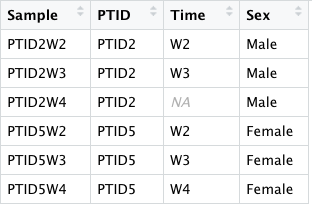{width="50%" height="50%"} <br>

Here, example of unbalanced data shown where 2 time points available for PTID2 (W2, W3) and 3 time points (W2, W3, W4) available for PTID5.

Follow the similar steps as mentioned in section 3.2.

    #Celltypes selected for analysis consisting atleast >5% of cells in each celltype.
      celltype_oi <- c("CD4_Naive","CD4_TEM","CD4_TCM","CD4_CTL","CD8_Naive",
                 "CD8_TEM","CD8_TCM","Treg","MAIT","gdT",
                 "NK", "NK_CD56bright",
                 "B_naive", "B_memory", "B_intermediate",
                 "CD14_Mono","CD16_Mono",
                 "cDC2","pDC")

    #Create PALMO object
    palmo_obj <- createPALMOobject(anndata=ann, data=pbmc)

    #Assign Sample, PTID and Time parameters
    palmo_obj <- annotateMetadata(data_object=palmo_obj,
                              sample_column= "Sample",
                              donor_column= "PTID",
                              time_column= "Time")

The missing value row is removed

    >In annotateMetadata(data_object = palmo_obj, sample_column = "Sample",  :
    >Caution -> The Sample_column, Donor_column or
    >Time_column contains missing value or NA. Missing data is removed.
                    
    #Sample overlap and final matrix
    palmo_obj <- mergePALMOdata(data_object=palmo_obj, datatype="singlecell")

    #Aggregate data (Psuedo-bulk)
    palmo_obj <- avgExpCalc(data_object=palmo_obj,
                        assay="RNA", group_column="celltype")
    head(palmo_obj@curated[["anndata"]]) #merged annotation data
    head(palmo_obj@curated[["data"]]) #scRNA average expression data

    #Check for replicates
    palmo_obj <- checkReplicates(data_object=palmo_obj, mergeReplicates = T)

    #Variance decomposition
    featureSet <- c("PTID", "Time","celltype")
    palmo_obj <- lmeVariance(data_object=palmo_obj,
                         featureSet=featureSet,
                         meanThreshold=0.1, cl=4,
                         fileName="scrna")

<br> 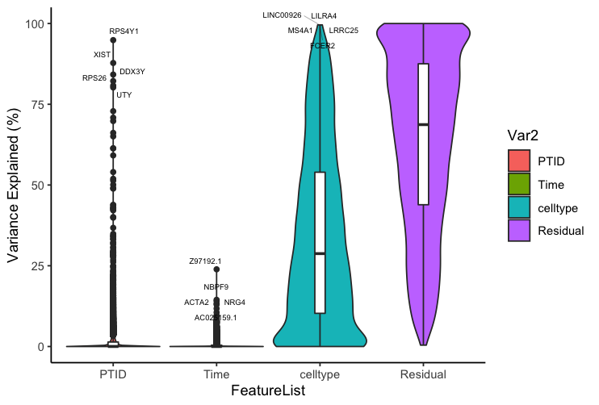{width="50%" height="50%"} <br>

    #Get the result
    var_decomp <- palmo_obj@result$variance_decomposition
    plots <- variancefeaturePlot(vardata=var_decomp, featureSet=featureSet,
                             cols=c("purple", "darkgreen", "cyan"), ncol=3)

<br> 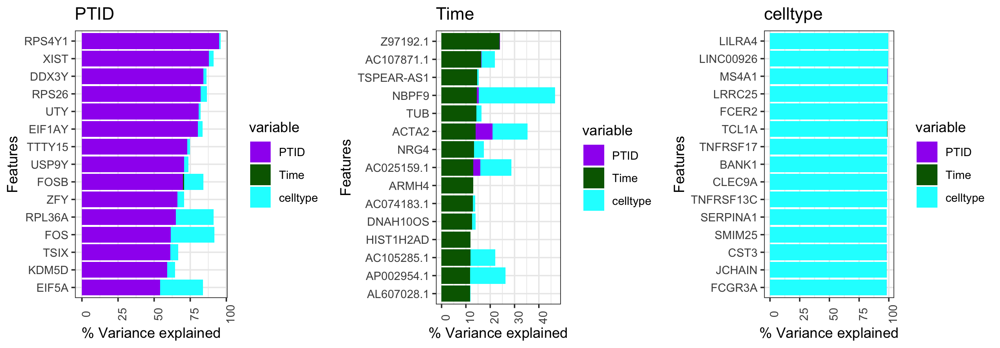 <br>

    #Intra-donor variations over time
    palmo_obj <- cvCalcSC(data_object=palmo_obj,
                        meanThreshold=0.1, cvThreshold=10,
                        housekeeping_genes=c("GAPDH", "ACTB"),
                        fileName="scrna")

    #Find stable and variable features in longitudinal data
    palmo_obj <- StableFeatures(data_object=palmo_obj, group_oi=celltype_oi,
                              cvThreshold=10,
                              topFeatures=10,
                              fileName="scrna")
    stable_genes <- palmo_obj@result$stable_genes

    palmo_obj <- VarFeatures(data_object=palmo_obj, group_oi=celltype_oi,
                           cvThreshold=10,
                           topFeatures=10,
                           fileName="scrna")
    var_genes <- palmo_obj@result$var_genes

<br> 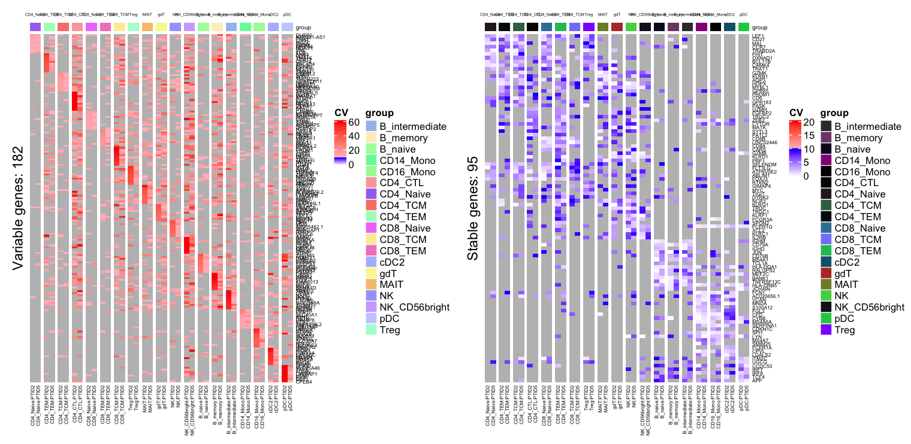 <br>

## Replicates in data

Many of biological studies have technical or biological replicates.
In case of replicates PALMO aggregates the replicates data into one sample and thus avoid bias due to bias by specific donor having multiple replicates.

We selected PBMC dataset from Guo et al. (2020) consisting single-cell RNA-seq of severe COVID-19 patients (GSE150861).
The dataset contains 2 donors and among one of them have replicates for timepoint day1 and day5.
In absence of processed dataset, we performed the preprocessing step in Seurat as mentioned by authors.
The parameters used for prepocessing were nFeature_RNA \> 500 and percent.mt \< 10%.
The resulting dataset consists of 13289 cells and 33538 genes.

<br> 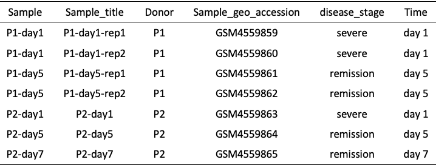{width="50%" height="50%"} <br>

    #Load library
    library("PALMO")
    library("Hmisc")

    #Load Single cell object GSE150861
    pbmc <- readRDS("data/GSE150861_seurat.RDS")
    metaDF <- pbmc@meta.data
    #check celltypes
    clusterName <- sort(unique(pbmc@meta.data$seurat_clusters))

    #Clinical annotations Table S1. Clinical data of the enrolled subjects
    library(readxl)
    library(tidyverse)
    metadata <- read_excel("data/GSE150861_series_matrix.xlsx", sheet ="Sheet1", na = c("", NA)) %>%
        as.data.frame()

    #Create PALMO object
    palmo_obj <- createPALMOobject(anndata=metadata, data=pbmc)

    #Assign Sample, PTID and Time parameters
    palmo_obj <- annotateMetadata(data_object=palmo_obj, sample_column= "Sample",
                                  donor_column= "Donor", time_column= "Time")
    #Sample overlap and final matrix
    palmo_obj <- mergePALMOdata(data_object=palmo_obj, datatype="singlecell")

    #Reduce the size of PALMO object
    palmo_obj@raw$data <- NULL

    #Aggregate samples by sample group (Psuedo-bulk)
    palmo_obj <- avgExpCalc(data_object=palmo_obj, assay="RNA",
                        group_column ="seurat_clusters")
    head(palmo_obj@curated[["anndata"]]) #merged annotation data
    head(palmo_obj@curated[["data"]]) #scRNA average expression data

    #Check for replicates
    palmo_obj <- checkReplicates(data_object=palmo_obj, mergeReplicates=T)

    #Replicates for data found
    #  Var1  Var2 Freq
    #1   P1 day 1    2
    #3   P1 day 5    2
    #Merging replicates by Median
    #Check PALMO object (anndata, data). To ignore replicates use mrgereplicates=FALSE.

    #Variance decomposition (Time ~7min)
    featureSet <- c("Donor","Time","seurat_clusters")
    palmo_obj <- lmeVariance(data_object=palmo_obj,
                             featureSet=featureSet,
                             meanThreshold=0.1,
                             fileName="GSE150861")
    var_decomp <- palmo_obj@result$variance_decomposition
    head(var_decomp[,featureSet])

    #Variance contributing features
    plots <- variancefeaturePlot(vardata=var_decomp,
                                 featureSet=featureSet,
                                 Residual=F,ncol=3)
    plot_grid(plotlist = plots, ncol=3)

<br> 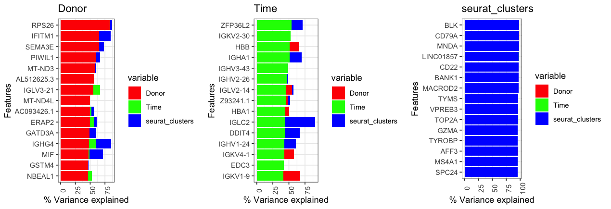 <br>

    #Check the mean expression and CV across groups (celltypes)
    palmo_obj <- cvCalcSCProfile(data_object=palmo_obj,
                       housekeeping_genes=c("GAPDH", "ACTB"),
                       fileName="GSE150861")

<br> 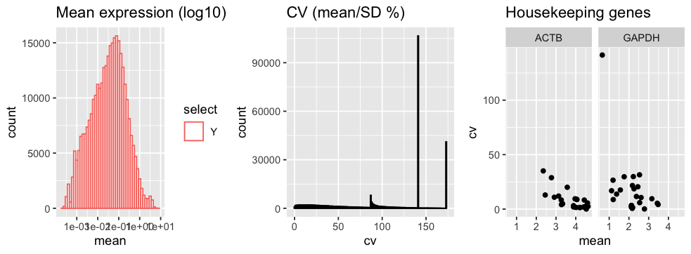 <br>

    #Calculate CV (Time ~2min)
    palmo_obj <- cvCalcSC(data_object=palmo_obj,
                      meanThreshold=0.1, cvThreshold=20,
                      housekeeping_genes=c("GAPDH", "ACTB"),
                      fileName="GSE150861")

<br> 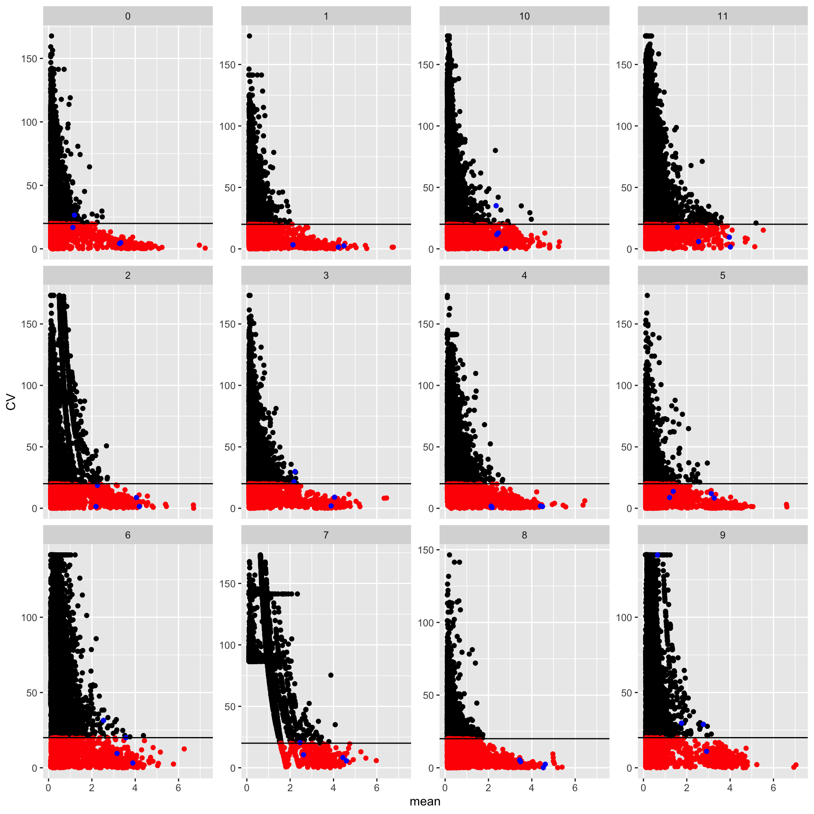{width="50%" height="50%"} <br>

The stable and variable genes in a data set can be identified following the steps from Section 3.2.4 to 3.2.12.

## Single donor with multiple timepoint

Users can analyze the data with single donor and multiple time points.
For example, data set from Tutorial 2.
Select single cell data for donor "PTID2" with 6 time points.

    #Load annotation data
    load("data/data_Metadata.Rda")
    ann <- ann[ann$PTID %in% "PTID2",] #Selecte one donor only

Please follow the steps from section 3.2.2 to 3.2.11.

    #scRNA seurat object
    #Celltypes selected for analysis consisting atleast >5% of cells in each celltype.
    celltype_oi <- c("CD4_Naive","CD4_TEM","CD4_TCM","CD4_CTL","CD8_Naive",
                     "CD8_TEM","CD8_TCM","Treg","MAIT","gdT","NK", 
                     "NK_CD56bright","B_naive", "B_memory", "B_intermediate",
                     "CD14_Mono","CD16_Mono","cDC2","pDC")

    #Create PALMO object
    palmo_obj <- createPALMOobject(anndata=ann, data=pbmc)

    #Assign Sample, PTID and Time parameters
    palmo_obj <- annotateMetadata(data_object=palmo_obj, sample_column= "Sample", donor_column= "PTID", time_column= "Time")
    #Sample overlap and final matrix
    palmo_obj <- mergePALMOdata(data_object=palmo_obj, datatype="singlecell")
    #Reduce the size of PALMO object
    #palmo_obj@raw$data <- NULL

    #Aggregate data (Psuedo-bulk)
    #Aggregated samples noted by sample group
    palmo_obj <- avgExpCalc(data_object=palmo_obj, assay="RNA", group_column="celltype")
    head(palmo_obj@curated[["anndata"]]) #merged annotation data
    head(palmo_obj@curated[["data"]]) #scRNA average expression data

    #CV profile
    palmo_obj <- cvCalcSCProfile(data_object=palmo_obj,
                           housekeeping_genes=c("GAPDH", "ACTB"),
                           meanThreshold = 0.1,
                           fileName="scrna")

    #Features contributing towards donor variations
    #Variance decomposition
    featureSet <- c("Time","celltype") 
    palmo_obj <- lmeVariance(data_object=palmo_obj,
                             featureSet=featureSet,
                             meanThreshold=0.1, cl=4,
                             fileName="scrna")
    var_decomp <- palmo_obj@result$variance_decomposition
    head(var_decomp[,featureSet])

    #Variance contributing features
    plots <- variancefeaturePlot(vardata=var_decomp, featureSet=featureSet,
                                 Residual=F,
                                 cols=c("purple", "darkgreen"))

<br> 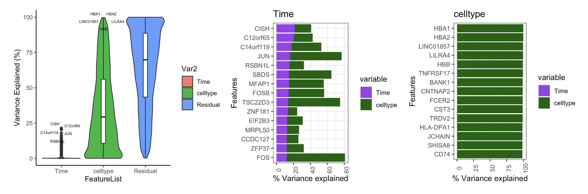 <br>

    #Calculate CV
    palmo_obj <- cvCalcSC(data_object=palmo_obj,
                          meanThreshold=0.1, cvThreshold=10,
                          housekeeping_genes=c("GAPDH", "ACTB"),
                          fileName="scrna")

    #Find stable and variable features in longitudinal data
    palmo_obj <- StableFeatures(data_object=palmo_obj, group_oi=celltype_oi,
                                  cvThreshold=10,
                                  topFeatures=10,
                                  fileName="scrna")
    stable_genes <- palmo_obj@result$stable_genes

    palmo_obj <- VarFeatures(data_object=palmo_obj, group_oi=celltype_oi,
                            cvThreshold=10,
                             topFeatures=10,
                            fileName="scrna")
    var_genes <- palmo_obj@result$var_genes

<br> 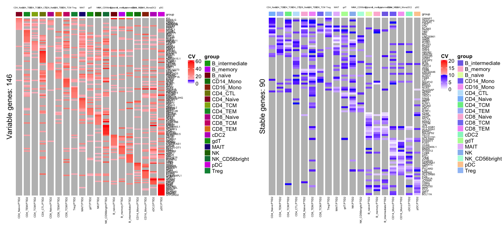 <br>

    #UMAP Plot
    #Top stable and variable features used for UMAP
    dimUMAPPlot(data_object=palmo_obj, nPC=15, gene_oi=unique(stable_genes$gene),
                group_column="celltype", plotname="stable",
                fileName="scrna")

    dimUMAPPlot(data_object=palmo_obj, nPC=15, gene_oi=unique(var_genes$gene),
                group_column="celltype", plotname="variable",
                fileName="scrna")

<br> 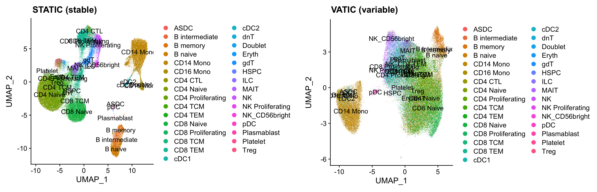 <br>

## Identify longitudinal pattern in a single cell dataset (pseudo-bulk)

To identify the internal structures of gene expression over longitudinal time points we incorporated soft clustering analysis from [mfuzz](https://www.bioconductor.org/packages/release/bioc/html/Mfuzz.html) package into PALMO.
PALMO uses pseudo-bulk from single cell data at celltypes/groups and allows users to identify the longitudinal trajectories for features in data.
For example, using longitudinal data set we focused on similar gene expression patterns in CD4 Naive cells.

    #Longitudinal dynamics: mFuzz
    library("Mfuzz")
    library("tidyverse")
    unique(palmo_obj@curated$anndata[["celltype"]])
    palmo_obj <- longitudinalmfuzz(data_object=palmo_obj, group_column="celltype",
                           timeColumn="Time", max_cluster=8,
                           #baseline_timepoint="W2",
                           group_oi=c("CD4_Naive","B_naive","CD14_Mono"))
    #Identifying Longitudinal Trajectories
    #Time order->W2W3W4W5W6W7.
    #To change time order use parameter timeOrder=c('t1', 't2', 't3').
    #Running ::PTID2-CD4_Naive
    #4276 genes excluded (features with no variance are removed)

<br> 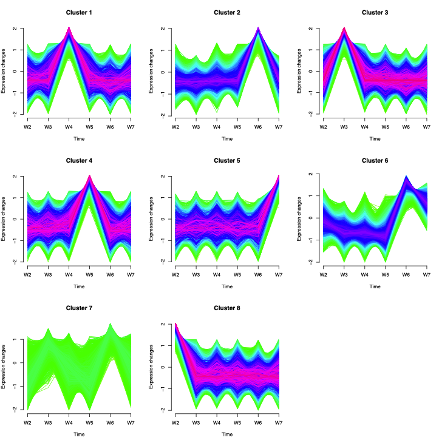 <br>