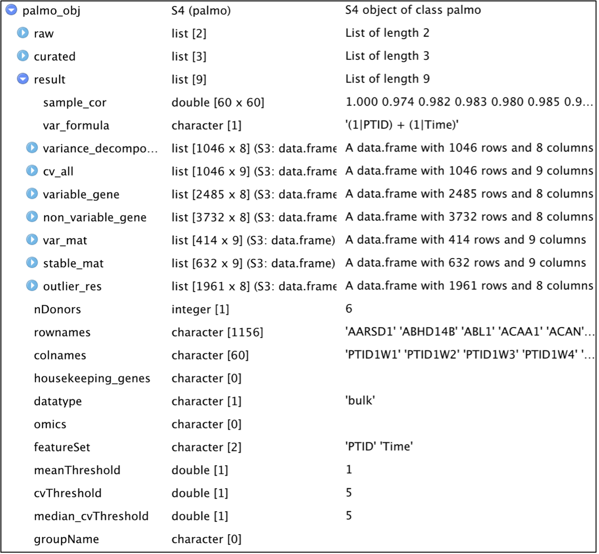

```{r, include = FALSE}
knitr::opts_chunk$set(
  collapse = TRUE,
  comment = "#>"
)
```

# <a name="example9"></a> PALMO Data Structure

PALMO uses createPALMOobject(anndata, data) function to create S4 object.
The S4 object stores all input and output information in PALMO object.
The representative PALMO S4 object structure is shown in Figure below.
Users can access the data and result directly from PALMO S4 object .

<br>  <br>