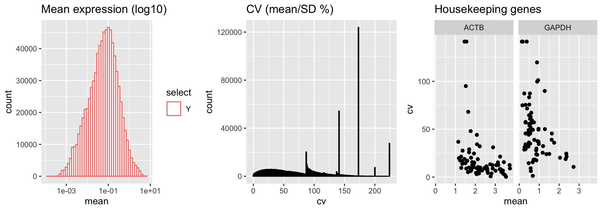
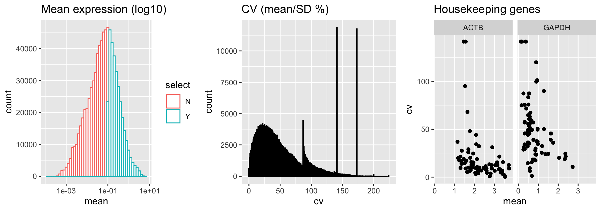
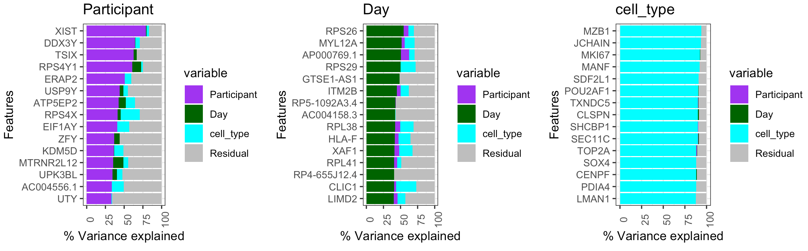
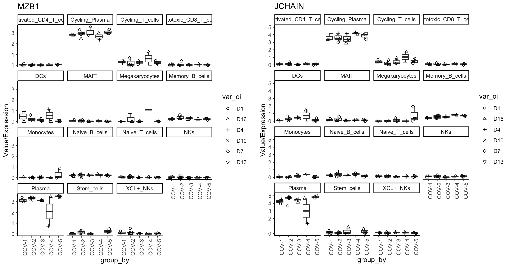
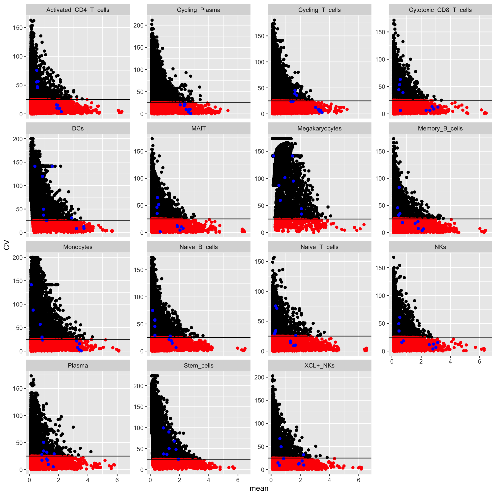
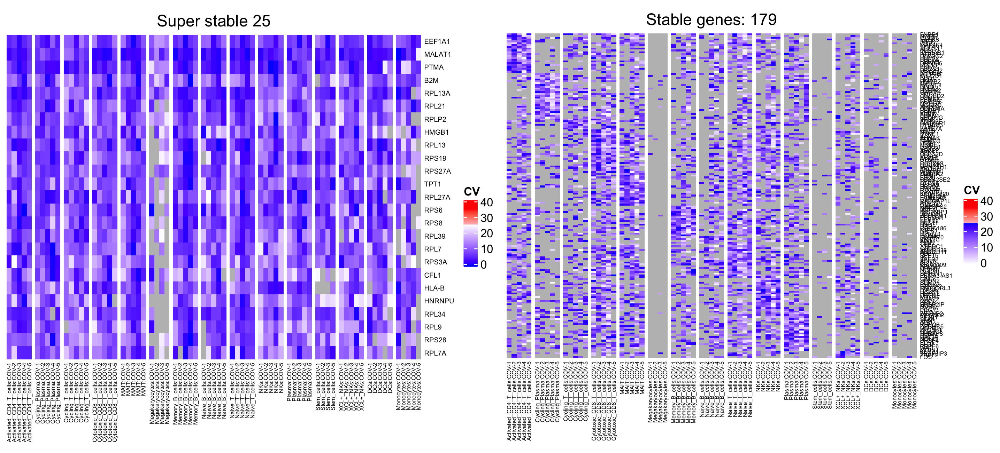
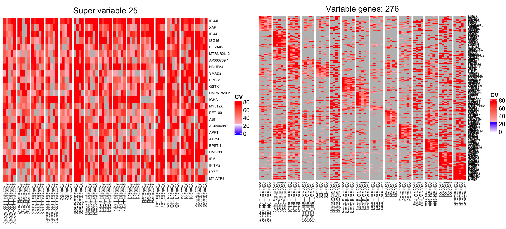
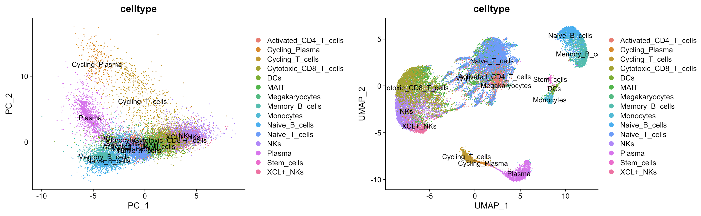

```{r, include = FALSE}
knitr::opts_chunk$set(
  collapse = TRUE,
  comment = "#>"
)
```


# <a name="example5"></a> COVID19 Longitudinal Dataset (CNP0001102)

This tutorial allows to explore single cell RNAseq data variability across COVID and FLU donors.
PBMCs from the healthy, COVID and FLU donors were collected longitudinally.
Single cell data from [Zhu et al. 2020](https://www.ncbi.nlm.nih.gov/pmc/articles/PMC7368915/) downloaded from [CNP0001102](https://db.cngb.org/search/project/CNP0001102/).
Metadata is downloaded from Supplementary table and curated version can be found in the [metadata](https://github.com/aifimmunology/PALMO/blob/data/data/CNP0001102-annotation.csv).
To infer variability (inter- and Intra-) and identify stable genes, please follow following steps.

## Load Library

    #Load Library
    library("PALMO")

## Load data and assign parameters (Time \< 1min)

Load single cell data and define the Sample column which is same as Sample column in metadata.

    #Load scRNA data
    pbmc <- readRDS("data/CNP0001102_Final_nCoV_0716_upload.RDS")
    #Add column Sample
    pbmc@meta.data$Sample <- pbmc@meta.data$batch
    #check celltypes
    sort(unique(pbmc@meta.data$cell_type))
    #[1] Cytotoxic CD8 T cells Naive T cells         NKs                  
    #[4] MAIT                  Activated CD4 T cells Naive B cells        
    #[7] Plasma                Memory B cells        XCL+ NKs             
    #[10] Cycling T cells       Monocytes             DCs                       
    #[13] Cycling Plasma        Stem cells            Megakaryocytes 

    #Clinical annotations Table S1. Clinical data of the enrolled subjects
    metadata <- read.csv("data/CNP0001102-annotation.csv", stringsAsFactors = F)

    #Exploring only COVID samples 
    metadata <- metadata[metadata$Participant %in% c("COV-1", "COV-2", "COV-3", "COV-4", "COV-5"),]
    #Exploring only FLU samples
    #metadata <- metadata[metadata$Participant %in% c("IAV-1","IAV-2"),]

## Create PALMO object (Time \< 1min)

First create the PALMO S4 object using input scRNA object and annotation dataframe.
The expression dataframe columns merged with input annotation dataframe.
Only overlapping samples kept.

    #Create PALMO object
    palmo_obj <- createPALMOobject(anndata=metadata, data=pbmc)

    #Assign Sample, PTID and Time parameters
    palmo_obj <- annotateMetadata(data_object=palmo_obj,
                                  sample_column= "Sample",
                                  donor_column= "Participant",
                                  time_column= "Day")

Assign sample_column, donor_column and time_column variables in this step.

    #Sample overlap and final matrix
    palmo_obj <- mergePALMOdata(data_object=palmo_obj, datatype="singlecell")

Single cell data is aggregated by average method at sample group level.
Features with average expression greater than zero across all samples are kept.

    #Aggregate data (Psuedo-bulk)
    palmo_obj <- avgExpCalc(data_object=palmo_obj, assay="RNA",
                            group_column="cell_type")
    head(palmo_obj@curated[["anndata"]]) #merged annotation data
    head(palmo_obj@curated[["data"]]) #scRNA average expression data

**Optional step**.
If data consists of replicates can be merged by mergeReplicates = TRUE.

    #Check for replicates
    palmo_obj <- checkReplicates(data_object=palmo_obj, mergeReplicates = T)

## CV profile (Time \~ 1min)

To calculate longitudinal stability within donor first visualize the CV vs mean distribution for given data.
Define CV threshold using the histogram or selecting few features of interest CV as cut-off.
Here we used housekeeping genes GAPDH and ACTB to define CV threshold.

    palmo_obj <- cvCalcSCProfile(data_object=palmo_obj,
                           housekeeping_genes=c("GAPDH", "ACTB"),
                           fileName="CNP0001102")

<br>  <br>

    #Sample Celltype Mean-CV plot (output directory)
    palmo_obj <- cvCalcSCProfile(data_object=palmo_obj,
                           housekeeping_genes=c("GAPDH", "ACTB"),
                           meanThreshold = 0.1,
                           fileName="CNP0001102")
                           

<br>  <br>

**Optional step**.
To check the donor or participant wise CV profile run the CV sample profile analysis.

    cvSCsampleprofile(data_object=palmo_obj,
                      meanThreshold = 0.1, plot_log10=T,
                      cvThreshold = 25)

## Features contributing towards donor variations (Time \~ 5min)

Variance decomposition analysis was performed to identify the features associated with attributes of interest such as participants, sex, disease type, celltype, or batch.
The `featureSet` is a list of variables for which fraction of variance explained by each gene is calculated.
The variance explained by each gene towards the `featureSet` of interest given in percentage.
*(Note: To reduce the processing time use nodes cl=8 (or greater) and lmer_control=TRUE)*

    #Check the group of interest
    head(palmo_obj@curated$anndata)

    #Variance decomposition
    featureSet <- c("Participant", "Day","cell_type")
    palmo_obj <- lmeVariance(data_object=palmo_obj,
                             featureSet=featureSet,
                             meanThreshold=0.1, cl=4,
                             fileName="CNP0001102")
    var_decomp <- palmo_obj@result$variance_decomposition
    head(var_decomp[,featureSet])
           Participant       Day cell_type
    #XIST      78.82243  0.936695  3.510383
    #DDX3Y     64.44897  0.637655  5.824030
    #TSIX      62.57711  3.997646  0.339527
    #RPS4Y1    60.73146 11.768212  2.346928
    #ERAP2     50.92503  0.000000  8.745452
    #USP9Y     44.21867  4.657177  5.997529

The top 15 features contributing to donor, time or celltype attributes variance can be seen in barplot.

    #Variance explained (Participant, Day, cell_type)
    plots <- variancefeaturePlot(vardata=var_decomp,
                             featureSet=featureSet,
                             Residual=T,
                             cols=c("purple", "darkgreen", "cyan"),
                             ncol=3)

<br>  <br>

## Plot the variables (Time \~ 10sec)

Gene expression plot for top features by cell_type can be visualized by donors or by time.

    plots <- gene_featureplot(data_object=palmo_obj,
                              featureList=c("MZB1", "JCHAIN"),
                              facet_by="cell_type", x_text_angle=90)

<br>  <br>

## Intra-donor variations over time (Time \~ 4min)

To calculate longitudinal stability within donor define meanThreshold and cvThreshold parameters as discussed above.
The analysis will calculate the CV across average group ("cell_type").
It will create a CV-Mean plots for individual donor over longitudinal timepoints that shows the highly variable and stable features in each donor.
The plots are stored in output directory.
It also provides a housekeeping genes position in CV-Mean plot across each celltype/group of interest.

    #Calculate CV
    palmo_obj <- cvCalcSC(data_object=palmo_obj,
                          meanThreshold=0.1, cvThreshold=25,
                          housekeeping_genes=c("GAPDH", "ACTB"),
                          fileName="CNP0001102")

<br>  <br>

*(Note: Black dots, all genes; red dots, genes with given mean and CV threshold; blue dots, housekeeping genes)*

## Find stable and variable features in longitudinal data (Time \~ 10sec)

Above step resulted CV values used to identify Stable and variable features across cell_type.
Minimum number of donors (`donorThreshold`) considered 5 to have consensus stable/variable profile over timepoints.
`groupThreshold` considered 38 (number of donors \* number of celltypes/2 = 5x15/2 \~ 37.5).

    palmo_obj <- StableFeatures(data_object=palmo_obj,
                                cvThreshold=25,
                                donorThreshold=5,
                                topFeatures=25,
                                fileName="CNP0001102")
    stable_genes <- palmo_obj@result$stable_genes

<br>  <br>

    palmo_obj <- VarFeatures(data_object=palmo_obj,
                             cvThreshold=25,
                             donorThreshold=5,
                             topFeatures=25,
                             fileName="CNP0001102")
    var_genes <- palmo_obj@result$var_genes

<br>  <br>

## UMAP Plot (Time \~ 2min)

To visualize how these stable or variable features performing, users can reduce high dimensional single cell data into lower dimensions using selected Top features from stable/variable analysis.
The UMAP plot shows whether identified stable features can reproduce celltype/group identity based on few but stable features.

    #Stable genes UMAP
    dimUMAPPlot(data_object=palmo_obj, nPC=15,
                gene_oi=unique(stable_genes$gene),
                group_column="cell_type", plotname="stable",
                fileName="CNP0001102")
                

<br>  <br>

    #Variable genes UMAP
    dimUMAPPlot(data_object=palmo_obj, nPC=15,
                gene_oi=unique(var_genes$gene),
                group_column="cell_type", plotname="variable",
                fileName="CNP0001102")
                

<br>  <br>

## Celltype-specific Circos CV Plot (Time \~ 30sec)

The top features from Activated CD4 T-cells and Cycling T-cells can be visualized in circos plot for easy comparison.

    #Activated CD4 T-cells
    geneList <- c("IRF3","MAP4K4","XPC","DNAJB6", "KLF13")
    plotres <- genecircosPlot(data_object=palmo_obj,
                              geneList=geneList, colorThreshold=25)

    #Cycling T-cells
    geneList <- c("HMGN2", "IFI16", "PTGES3", "SH3KBP1", "PTBP1")
    plotres <- genecircosPlot(data_object=palmo_obj,
                              geneList=geneList, colorThreshold=25,
                              colorscale = TRUE)

<br>  <br>


# <a name="session"></a> Session Info

    sessionInfo()
    #> R version 4.1.2 (2021-11-01)
    #> Platform: x86_64-apple-darwin17.0 (64-bit)
    #> Running under: macOS Big Sur 10.16
    #> 
    #> Matrix products: default
    #> BLAS:   /Library/Frameworks/R.framework/Versions/4.1/Resources/lib/libRblas.0.dylib
    #> LAPACK: /Library/Frameworks/R.framework/Versions/4.1/Resources/lib/libRlapack.dylib
    #> 
    #> locale:
    #> [1] en_US.UTF-8/en_US.UTF-8/en_US.UTF-8/C/en_US.UTF-8/en_US.UTF-8
    #> 
    #> attached base packages:
    #> [1] grid      stats     graphics  grDevices utils     datasets  methods  
    #> [8] base     
    #> 
    #> other attached packages:
    #> [1] PALMO_0.1.1
    #> 
    #> loaded via a namespace (and not attached):
    #>   [1] utf8_1.2.2                  reticulate_1.25            
    #>   [3] tidyselect_1.1.2            lme4_1.1-31                
    #>   [5] htmlwidgets_1.5.4           Rtsne_0.16                 
    #>   [7] munsell_0.5.0               codetools_0.2-18           
    #>   [9] ragg_1.2.2                  ica_1.0-2                  
    #>  [11] future_1.26.1               miniUI_0.1.1.1             
    #>  [13] withr_2.5.0                 spatstat.random_2.2-0      
    #>  [15] colorspace_2.0-3            progressr_0.10.1           
    #>  [17] Biobase_2.54.0              knitr_1.40                 
    #>  [19] rstudioapi_0.14             SingleCellExperiment_1.16.0
    #>  [21] Seurat_4.1.1                stats4_4.1.2               
    #>  [23] ROCR_1.0-11                 tensor_1.5                 
    #>  [25] listenv_0.8.0               MatrixGenerics_1.6.0       
    #>  [27] GenomeInfoDbData_1.2.7      polyclip_1.10-0            
    #>  [29] farver_2.1.1                pheatmap_1.0.12            
    #>  [31] rprojroot_2.0.3             parallelly_1.32.0          
    #>  [33] vctrs_0.5.1                 generics_0.1.3             
    #>  [35] xfun_0.33                   GenomeInfoDb_1.30.1        
    #>  [37] R6_2.5.1                    doParallel_1.0.17          
    #>  [39] clue_0.3-61                 DelayedArray_0.20.0        
    #>  [41] bitops_1.0-7                spatstat.utils_2.3-1       
    #>  [43] cachem_1.0.6                assertthat_0.2.1           
    #>  [45] promises_1.2.0.1            scales_1.2.1               
    #>  [47] rgeos_0.5-9                 gtable_0.3.1               
    #>  [49] globals_0.15.0              goftest_1.2-3              
    #>  [51] rlang_1.0.6                 systemfonts_1.0.4          
    #>  [53] GlobalOptions_0.1.2         splines_4.1.2              
    #>  [55] lazyeval_0.2.2              spatstat.geom_2.4-0        
    #>  [57] broom_0.8.0                 yaml_2.3.5                 
    #>  [59] reshape2_1.4.4              abind_1.4-5                
    #>  [61] modelr_0.1.8                backports_1.4.1            
    #>  [63] httpuv_1.6.5                tools_4.1.2                
    #>  [65] ggplot2_3.4.0               ellipsis_0.3.2             
    #>  [67] spatstat.core_2.4-4         jquerylib_0.1.4            
    #>  [69] RColorBrewer_1.1-3          BiocGenerics_0.40.0        
    #>  [71] ggridges_0.5.3              Rcpp_1.0.9                 
    #>  [73] plyr_1.8.7                  zlibbioc_1.40.0            
    #>  [75] RCurl_1.98-1.8              purrr_0.3.4                
    #>  [77] rpart_4.1.16                deldir_1.0-6               
    #>  [79] pbapply_1.5-0               GetoptLong_1.0.5           
    #>  [81] cowplot_1.1.1               S4Vectors_0.32.4           
    #>  [83] zoo_1.8-10                  SummarizedExperiment_1.24.0
    #>  [85] SeuratObject_4.1.0          haven_2.5.0                
    #>  [87] ggrepel_0.9.1               cluster_2.1.3              
    #>  [89] factoextra_1.0.7            fs_1.5.2                   
    #>  [91] magrittr_2.0.3              data.table_1.14.2          
    #>  [93] scattermore_0.8             circlize_0.4.15            
    #>  [95] lmtest_0.9-40               reprex_2.0.1               
    #>  [97] RANN_2.6.1                  fitdistrplus_1.1-8         
    #>  [99] matrixStats_0.62.0          hms_1.1.2                  
    #> [101] patchwork_1.1.1             mime_0.12                  
    #> [103] evaluate_0.16               xtable_1.8-4               
    #> [105] readxl_1.4.0                IRanges_2.28.0             
    #> [107] gridExtra_2.3               shape_1.4.6                
    #> [109] compiler_4.1.2              tibble_3.1.8               
    #> [111] KernSmooth_2.23-20          crayon_1.5.1               
    #> [113] minqa_1.2.4                 htmltools_0.5.3            
    #> [115] mgcv_1.8-40                 later_1.3.0                
    #> [117] tzdb_0.3.0                  tidyr_1.2.1                
    #> [119] lubridate_1.8.0             DBI_1.1.3                  
    #> [121] tweenr_1.0.2                dbplyr_2.2.1               
    #> [123] ComplexHeatmap_2.10.0       MASS_7.3-57                
    #> [125] MAST_1.20.0                 boot_1.3-28                
    #> [127] Matrix_1.5-1                readr_2.1.2                
    #> [129] cli_3.4.0                   parallel_4.1.2             
    #> [131] igraph_1.3.2                GenomicRanges_1.46.1       
    #> [133] forcats_0.5.2               pkgconfig_2.0.3            
    #> [135] pkgdown_2.0.7               sp_1.5-0                   
    #> [137] plotly_4.10.0               spatstat.sparse_2.1-1      
    #> [139] xml2_1.3.3                  foreach_1.5.2              
    #> [141] bslib_0.3.1                 XVector_0.34.0             
    #> [143] rvest_1.0.2                 stringr_1.4.1              
    #> [145] digest_0.6.29               sctransform_0.3.3          
    #> [147] RcppAnnoy_0.0.19            spatstat.data_2.2-0        
    #> [149] rmarkdown_2.14              cellranger_1.1.0           
    #> [151] leiden_0.4.2                uwot_0.1.14                
    #> [153] shiny_1.7.1                 rjson_0.2.21               
    #> [155] nloptr_2.0.3                lifecycle_1.0.3            
    #> [157] nlme_3.1-158                jsonlite_1.8.0             
    #> [159] desc_1.4.1                  viridisLite_0.4.1          
    #> [161] fansi_1.0.3                 pillar_1.8.1               
    #> [163] lattice_0.20-45             fastmap_1.1.0              
    #> [165] httr_1.4.4                  survival_3.3-1             
    #> [167] glue_1.6.2                  png_0.1-7                  
    #> [169] iterators_1.0.14            ggforce_0.3.3              
    #> [171] stringi_1.7.8               sass_0.4.1                 
    #> [173] textshaping_0.3.6           memoise_2.0.1              
    #> [175] dplyr_1.0.10                tidyverse_1.3.1            
    #> [177] irlba_2.3.5                 future.apply_1.9.0
*The analysis time reported in tutorials were based on macOS with 2.3GHz 8-core Intel Core i9 processor and 32GB RAM memory.*

\newpage
\newpage
